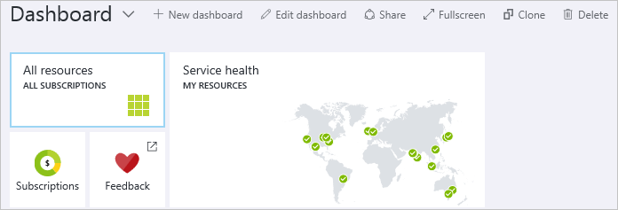
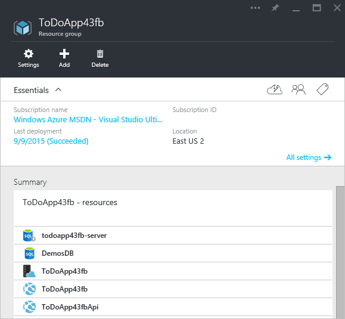
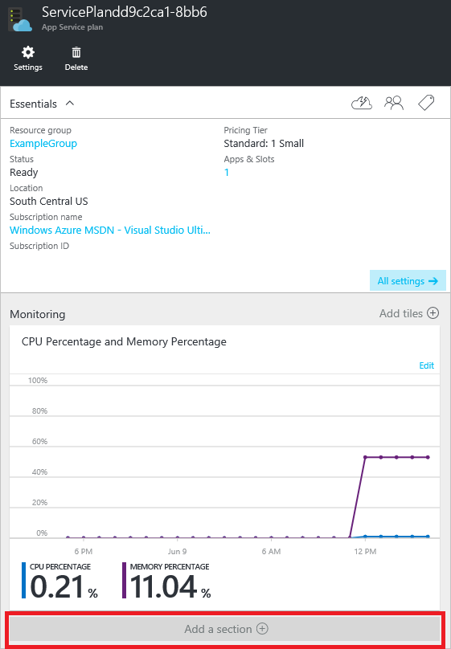
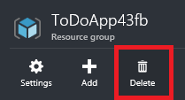

<properties 
	pageTitle="使用 Azure 门户管理 Azure 资源 | Azure" 
	description="使用 Azure 门户和 Azure Resource Manager 来管理资源。说明如何使用仪表板和磁贴来资源监视。" 
	services="azure-resource-manager,azure-portal" 
	documentationCenter="" 
	authors="tfitzmac" 
	manager="timlt" 
	editor="tysonn"/>

<tags 
	ms.service="azure-resource-manager" 
	ms.date="06/10/2016" 
	wacn.date="07/18/2016"/>

# 通过门户管理 Azure 资源

本主题说明如何将 [Azure 门户](https://portal.azure.cn)与 [Azure Resource Manager](/documentation/articles/resource-group-overview/) 配合使用来管理 Azure 资源。若要了解如何通过门户部署资源，请参阅 [Deploy resources with Resource Manager templates and Azure portal](/documentation/article/resource-group-template-deploy-portal/)（使用 Resource Manager 模板和 Azure 门户部署资源）。

目前，并非每种服务都支持门户或资源管理器。对于这些服务，需要使用[管理门户](https://manage.windowsazure.cn)。若要了解每种服务的状态，请参阅 [Azure portal availability chart](/features/azure-portal/availability/)（Azure 门户可用性图表）。

## 自定义仪表板以监视资源

门户提供了一个仪表板用于监视和管理资源。该仪表板完全可自定义，你可以创建多个仪表板，以便提供订阅的不同视图。

### 共享 Azure 仪表板和访问控制
配置仪表板后，可将其发布，并与组织中的其他用户共享。Azure [基于角色的访问控制](/documentation/articles/active-directory/role-based-access-control-configure/)掌控了对门户中磁贴所显示信息的访问。所有发布的仪表板都将作为 Azure 资源实现。从访问控制角度来看，仪表板与虚拟机或存储帐户没有什么不同。

下面是一个示例。假设你有 Azure 订阅，并且你团队中的各个成员都分配了订阅的**所有者**、**参与者**或**读取者**角色。作为所有者或参与者的用户能够列出、查看、创建、修改或删除订阅中的仪表板。作为读取者的用户能够列出并查看仪表板，但不能修改或删除它们。具有读取者访问权限的用户能够对已发布的仪表板进行本地编辑（例如排查问题时），但不能将这些更改发布回服务器。他们可以为自己制作仪表板的私有副本。

仪表板中的各个磁贴将根据其显示的资源强制实施自身的访问控制要求。因此，你可以设计一个仪表板，该仪表板可供广泛共享，同时保护各个磁贴上的数据。

## 管理资源组

1. 若要查看订阅中的所有资源组，请选择“资源组”。

    

2. 选择你要管理的特定资源组。你会看到提供有关该资源组信息的资源组边栏选项卡，其中包括组中所有资源的列表。

    

    选择任一资源将显示有关该资源的详细信息。

3. 在资源的边栏选项卡中，可以通过选择摘要下方的“添加部分”来添加更多的图形和表。

    

4. 系统会显示一个磁贴库，以便选择想要在边栏选项卡中包含的信息。所显示磁贴的类型按资源类型筛选。选择不同的资源会更改可用的磁贴。

    

5. 将所需的磁贴拖到可用空间。

    

6. 在门户顶部选择“完成”后，你的新视图就是边栏选项卡的一部分了。

    

7. 为了快速访问资源组，可以将边栏选项卡固定到仪表板上。

    

    或者，可以通过选择该部分上方的省略号 (...) 将边栏选项卡的某一部分固定到仪表板上。还可以自定义边栏选项卡中该部分的大小，或完全删除它。下图显示如何固定、自定义或删除 CPU 和内存部分。

    

8. 将该部分固定到仪表板后，将会在仪表板上看到摘要。

    

并且，选择它后可立即看到关于该数据的详细信息。

## 标记资源

可以将标记应用到资源组和资源，以按照逻辑组织资产。有关通过门户使用标记的信息，请参阅 [Using tags to organize your Azure resources](/documentation/articles/resource-group-using-tags/)（使用标记来组织 Azure 资源）。

## 查看订阅和成本

可以查看有关订阅的信息以及所有资源的汇总成本。选择“订阅”以及要查看的订阅。可能只能选择一个订阅。

在订阅边栏选项卡中，可以看到消耗率。

以及按资源类型划分的成本明细。

## 导出模板

设置资源组后，你可能想要查看资源组的 Resource Manager 模板。导出模板有两个好处：

1. 由于所有基础结构都已定义于模板中，因此可以轻松地自动进行解决方案的将来部署。

2. 可以查看代表解决方案的 JavaScript 对象表示法 (JSON)，以此熟悉模板语法。

有关分步指导，请参阅 [Export Azure Resource Manager template from existing resources](/documentation/articles/resource-manager-export-template/)（从现有资源导出 Azure Resource Manager 模板）。

## 删除资源组或资源

删除资源组会删除其包含的所有资源。你也可以删除资源组中的单个资源。在删除资源组时请多加小心，因为其中可能包含与其链接的其他资源组中的资源。链接的资源不会被删除，但可能无法按预期工作。

## 后续步骤

- 若要查看审核日志，请参阅 [Audit operations with Resource Manager](/documentation/articles/resource-group-audit/)（使用资源管理器执行审核操作）。
- 若要排查部署错误，请参阅 [Troubleshooting resource group deployments with Azure Portal](/documentation/articles/resource-manager-troubleshoot-deployments-portal/)（使用 Azure 门户对资源组部署进行故障排除）。
- 若要通过门户部署资源，请参阅 [Deploy resources with Resource Manager templates and Azure portal](/documentation/articles/resource-group-template-deploy-portal/)（使用 Resource Manager 模板和 Azure 门户部署资源）。

<!---HONumber=Mooncake_0711_2016-->