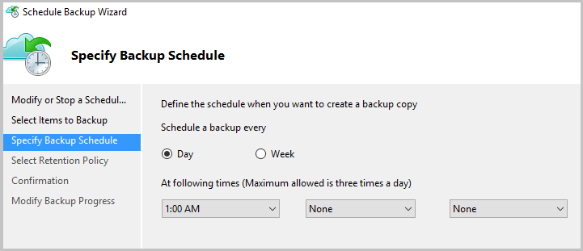

<!-- need to be customized -->

<properties
	pageTitle="管理 Azure 恢复服务保管库和服务器 | Azure"
	description="使用本教程来了解如何管理 Azure 恢复服务保管库和服务器。"
	services="backup"
	documentationCenter=""
	authors="Jim-Parker"
	manager="jwhit"
	editor="tysonn"/>

<tags
	ms.service="backup"
	ms.date="07/19/2016"
	wacn.date="09/05/2016"/>

# 监视和管理适用于 Windows 计算机的 Azure 恢复服务保管库和服务器

> [AZURE.SELECTOR]
- [资源管理器](/documentation/articles/backup-azure-manage-windows-server/)
- [经典](/documentation/articles/backup-azure-manage-windows-server-classic/)

本文概述了可通过 Azure 管理门户和 Azure 备份代理完成的备份管理任务。

> [AZURE.NOTE]Azure 具有用于创建和处理资源的两个不同的部署模型：[资源管理器和经典](/documentation/articles/resource-manager-deployment-model/)。这篇文章介绍如何使用资源管理器部署模型，Azure 建议大多数新部署使用资源管理器模型替代经典部署模型。

## 管理门户任务

目前，在 Azure 中国，暂时无法使用门户来管理 Azure 恢复服务保管库。

## Azure 备份代理任务

## 打开备份代理

打开 **Azure 备份代理**（可以通过在计算机中搜索 *Azure 备份* 来找到它）。

通过备份代理控制台右侧的“操作”，可以执行以下管理任务：

- 注册服务器
- 计划备份
- 立即备份
- 更改属性

>[AZURE.NOTE] 若要**恢复数据**，请参阅 [Restore files to a Windows server or Windows client machine](/documentation/articles/backup-azure-restore-windows-server/)（将文件还原到 Windows Server 或 Windows 客户端计算机）。

## 修改现有备份

1. 在 Azure 备份代理中，单击“计划备份”。

      

2. 在计划备份向导中，将“更改备份项或时间”选项保留选中状态，然后单击“下一步”。

    

3. 如果你要添加或更改项，请在“选择要备份的项”屏幕中单击“添加项”。

    还可以在此向导页中设置“排除设置”。如果你要排除文件或文件类型，请阅读有关添加[排除设置](#exclusion-settings)的过程。

4. 选择要备份的文件和文件夹，然后单击“确定”。

    

5. 指定“备份计划”并单击“下一步”。

    可以计划每日（一天最多 3 次）或每周备份。

      

    >[AZURE.NOTE] [此文](/documentation/articles/backup-azure-backup-cloud-as-tape/)中详细介绍了如何指定备份计划。

6. 选择备份副本的“保留策略”，然后单击“下一步”。

    

7. 在“确认”屏幕上复查信息，然后单击“完成”。

8. 向导完成创建备份计划后，请单击“关闭”。

    修改保护设置后，可以通过转到“作业”选项卡并确认更改已反映在备份作业中，来确认可正确触发备份。

## 启用网络限制  
Azure 备份代理提供的“限制”选项卡可让你控制在数据传输期间使用网络带宽的方式。如果需要在上班时间内备份数据，但不希望备份程序干扰其他 Internet 流量，此控制机制很有帮助。数据传输的限制适用于备份和还原活动。

若要启用限制，请执行以下操作：

1. 在“备份代理”中，单击“更改属性”。

2. 选中“为备份操作启用 Internet 带宽使用限制”复选磁贴。

    

3. 启用限制后，指定在“工作时间”和“非工作时间”允许使用多少带宽进行备份数据传输。

    带宽值从每秒 512 千字节 (Kbps) 开始，最高可为每秒 1023 兆字节 (Mbps)。你还可以指定“工作时间”的开始和结束时间，以及一周中有哪几天被视为工作日。在指定的工作时间之外的时间被视为非工作时间。

4. 单击**“确定”**。

## 管理排除设置

1. 打开 **Azure 备份代理**（可以通过在计算机中搜索 *Azure 备份* 来找到它）。

    

2. 在 Azure 备份代理中，单击“计划备份”。

      

3. 在计划备份向导中，将“更改备份项或时间”选项保留选中状态，然后单击“下一步”。

    

4. 单击“排除设置”。

      

5. 单击“添加排除项”。

      

6. 选择位置，然后单击“确定”。

    

7. 在“文件类型”字段中添加文件扩展名。

      

    添加 .mp3 扩展名

      

    若要添加其他扩展名，请单击“添加排除项”，然后输入另一个文件类型扩展名（添加 .jpeg 扩展名）。

      

8. 添加所有扩展名之后，请单击“确定”。

9. 单击“下一步”继续运行计划备份向导，出现“确认”页时，请单击“完成”。

    

## 常见问题
**问 1. 备份作业失败以后，需要多长时间才会引发警报？**

答 1. Azure 备份失败以后，会在 5 分钟内引发警报。

**问 2.是否存在配置了通知却不发送电子邮件的情况？**

A2.如果将通知配置为每小时发送一次，而引发的警报在一小时内获得了解决，则不会发送电子邮件。

## 后续步骤
- [从 Azure 还原 Windows Server 或 Windows 客户端](/documentation/articles/backup-azure-restore-windows-server/)
- 若要了解有关 Azure 备份的详细信息，请参阅 [Azure 备份概述](/documentation/articles/backup-introduction-to-azure-backup/)
- 访问 [Azure 备份论坛](https://social.msdn.microsoft.com/forums/azure/zh-cn/home?forum=windowsazureonlinebackup)

<!---HONumber=Mooncake_0829_2016-->