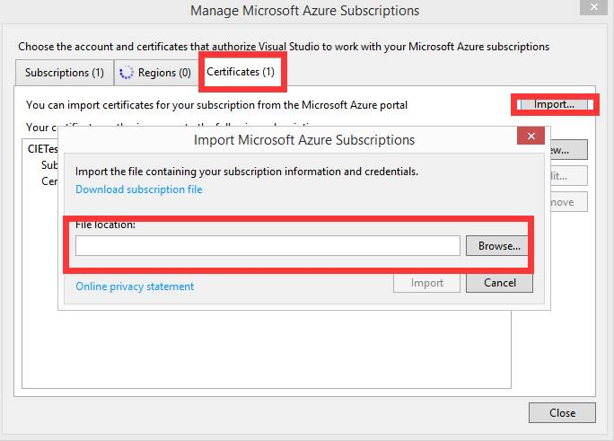
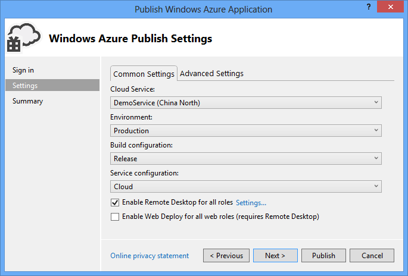
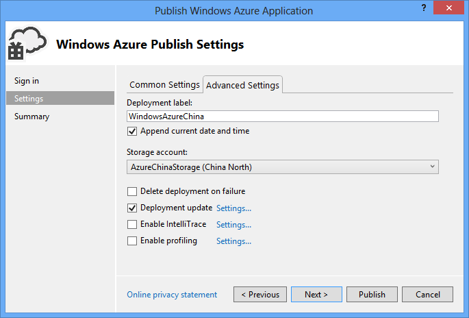
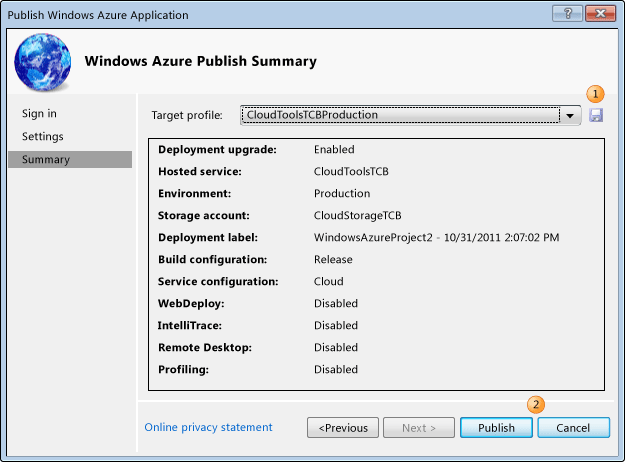

<properties linkid="DeveloperDifferences" urlDisplayName="DeveloperDifferences" pageTitle="DeveloperDifferences" metaKeywords="DeveloperDifferences" description="DeveloperDifferences" metaCanonical="" services="" documentationCenter="develop"  title="中国 Azure 应用程序开发人员说明" authors="" solutions="" manager="TK" editor="Eric Chen"/>
<tags ms.service="" ms.date="" wacn.date="09/23/2016"/>

#中国 Azure 应用程序开发人员说明

- [关于本文档](#about)
- [为开发人员提供指导](#dev-guide)
- [中国服务当前提供的功能](#readyonwacn)
- [在中国服务上创建应用程序时的区别概述](#cndiffoverview)
- [端点映射](#endpointmap)
- [中国的数据中心](#cncenter)
- [数据备份](#databackup)
- [设置用于开发的计算机](#confdevcomp)
- [配置订阅](#confsub)
- [配置设置](#confpref)
- [发布项目](#pubproj)
- [修改中国服务的配置和服务定义文件](#modifycnconf)
- [存储端点](#storagendpoint)
- [Azure 计算中的端口绑定](#waport)
- [与 SQL 数据库服务器的连接](#sqlcon)
- [服务总线和Active Directory](#srvbus-ad)
- [Active Directory](#ad)
- [服务总线配置](#srvbusconf)
- [使用服务管理 API](#srvapi)
- [将自定义域名重定向到中国服务中的托管服务](#dnsred)
- [对中国服务使用 VM 角色](#usecnvm)
- [使用 VM 角色和 CSUpload](#usevm)
- [修改代码示例和工具](#codetool)
- [常规工具](#nomaltool)
- [Visual Studio 服务器资源管理器](#vsexplorer)
- [CSManage - Azure 服务管理示例](#csmanage)
- [为中国服务更新 ServiceBus SDK 中的 PlainHttp 示例](#plainhttp)
- [使用 Azure 诊断](#wadig)
- [重新颁发 HTTPS 端点的证书](#http-cert)
- [使用 Azure PowerShell](#powershell)
- [使用 Node.js 的 Azure SDK](#nodejs)
- [附录：Azure 的内容库](#appendix)

#关于本文档

Microsoft 提供了一些工具来创建和部署 Azure 全球服务的云应用程序。

中国 Azure 是由中国公司世纪互联从位于中国人民共和国（不包括香港特别行政区、澳门特别行政区和中国台湾地区）的数据中心运营并提供的独立 Azure 平台。因此，创建和部署Azure 服务—由世纪互联运营（“中国服务”），而不是由全球服务运营的应用程序时，开发人员需要先了解这两项服务之间的主要区别，然后再设置自己的编程环境、编写应用程序并将其部署为在中国托管的服务。

本文档概要说明了这些区别并为中国 [Azure 门户](https://www.azure.cn)及 [MSDN 上的 Azure 技术库](http://msdn.microsoft.com/zh-cn/library/dd163896.aspx)提供补充信息。官方信息也会在许多其他地方发布，如 Azure [海报](http://www.microsoft.com/zh-cn/download/details.aspx?id=35473)、[TechNet wiki](http://social.technet.microsoft.com/wiki/contents/articles/inside-sql-azure.aspx) 以及 Microsoft 员工发表的各种博客文章。本内容专门针对将在中国部署托管于中国的数据中心的合作伙伴及开发人员。

有关中国服务功能可用性的最新更新，请访问中国[Azure 门户](https://www.azure.cn)。有关 Azure 上当前内容资产的列表，请参阅本文档的附录。
 
#为开发人员提供指导

由于 Microsoft 提供的大部分英文技术内容当前均假定应用程序是针对全球服务而开发，而非中国服务，因此务必确保开发人员了解为托管于中国而开发的应用程序的主要区别。
首先，功能上的差异，意即全球服务中的某些功能在中国不提供。
其次，在中国提供的功能具有运营差异，意即如需使用公共英文内容（针对全球服务而撰写），则必须自定义任何示例代码和步骤。

#中国服务当前提供的功能

中国服务当前包含以下的 Azure 功能。

* 计算 – Windows 虚拟机
* 计算 – Linux 虚拟机
* 计算 – 云服务
* 计算 – 批处理（Batch）
* 计算 – Service Fabric
* Web 和移动 – Web 应用
* Web 和移动 – 移动服务
* Web 和移动 – 通知中心
* 数据和存储 – SQL 数据库
* 数据和存储 – Redis 缓存
* 数据和存储 – 存储
* 数据和存储 – MySQL Database on Azure
* 数据和存储 – SQL 数据仓库
* 数据和存储 – SQL Server Stretch Database
* 数据和存储 – DocumentDB
* 分析 – HDInsight
* 分析 – 流分析
* 分析 – 事件中心
* 物联网 – Azure IoT 中心
* 物联网 – 事件中心
* 物联网 – 流分析
* 物联网 – 通知中心
* 网络服务 – 虚拟网络
* 网络服务 – ExpressRoute
* 网络服务 – 流量管理器
* 网络服务 – VPN 网关
* 网络服务 – 应用程序网关
* 媒体和CDN – 媒体服务 
* 媒体和CDN – CDN
* 混合集成 – 服务总线 
* 混合集成 – 备份  
* 混合集成 – 站点恢复  
* 身份和访问管理 – Active Directory
* 身份和访问管理 – 多重身份验证
* 管理与安全 – 计划程序
* 管理与安全 – 自动化
* 管理与安全 – 密钥保管库

<!--
#中国服务当前未提供的功能

中国服务当前不包含以下的 Azure 功能。

* 计算 – 在中国服务中，辅助角色实例不能作为计算资源添加到由 Microsoft HPC Pack 2008 R2 或 Microsoft HPC Pack 2012 创建的本地高性能计算 (HPC) 群集中。HPC Pack 仅支持在全球服务中添加辅助角色实例。
* 计算 - Batch
* 计算 - RemoteApp
* 计算 - Service Febric
* Access Control Service(访问控制服务)命名空间
* 数据服务 – SQL Reporting
* 数据服务 – SQL 数据同步
* 数据服务 – DocumentDB
* 数据服务 - Redis 缓存
* 数据服务 - Azure搜索
* 数据服务 - 机器学习
* 数据服务 - 流分析
* 数据服务 - 数据工厂
* 网络服务 - ExpressRoute
* 应用服务 - BizTalk 服务
* 应用服务 - 多重身份认证（Multi-Factor Authentication）
* SQL 数据库管理门户
* 秘钥保管库
* Visual Studio Online
-->

#在中国服务上创建应用程序时的区别概述

Azure 中的托管服务由一个设计为在托管服务中运行的应用程序和多个定义托管服务如何运行的 XML 配置文件组成。托管服务同时使用服务定义文件 (.csdef) 和配置文件 (.cscfg)。在中国服务上开发托管服务时的一项主要区别是端点地址具有不同的 URI。例如，Azure 和 SQL 数据库的 URI 通常以chinacloudapi.cn结尾。中国服务的开发人员必须能够识别 URI 端点的不同之处，然后将其使用的工具以及开发的应用程序配置为使用这些不同端点的对应 URI。
以下是需要更改端点 URI 时的示例：

* 配置 Visual Studio 时
* 定义 SQL 数据库的连接字符串时
* 定义 Azure 存储的连接字符串时
* 定义 Azure 计算的端口通信时
* 使用服务管理 API 时
* 将 URL 从自定义域名重定向到您所托管的服务时
* 发行 HTTPS 端点证书时
* 使用 Azure 诊断（诊断使用 Azure 存储）时
* 使用设计为在 Azure 上运行的工具和服务（这些工具和服务具有其自己的配置文件或服务定义文件）时
* 使用 CSUPLOAD 工具为 VM 角色上传映像

##端点映射

将 Azure 和 SQL 数据库公共端点映射到中国特定的端点时，请参照下表。
 

服务类型|全球服务URI|中国服务URI
:--|:--|:--
Azure - 常规 | *.windows.net | *.chinacloudapi.cn
Azure - 计算 | *.cloudapp.net | *.chinacloudapp.cn  
Azure - Service Fabric Cluster | *.cloudapp.azure.com | *.chinaeast.chinacloudapp.cn
Azure - 存储 | *.blob.core.windows.net   *.queue.core.windows.net   *.table.core.windows.net | *.blob.core.chinacloudapi.cn   *.queue.core.chinacloudapi.cn   *.table.core.chinacloudapi.cn
Azure - 服务管理 | https://management.core.windows.net | https://management.core.chinacloudapi.cn
Azure - 资源管理器(ARM) | https://management.azure.com | https://management.chinacloudapi.cn
SQL 数据库 | *.database.windows.net | *.database.chinacloudapi.cn
Azure - 管理门户 | http://manage.windowsazure.com | http://manage.windowsazure.cn
SQL Azure数据库管理API | https://management.database.windows.net | https://management.database.chinacloudapi.cn
服务总线 | *.servicebus.windows.net | *.servicebus.chinacloudapi.cn
ACS | *.accesscontrol.windows.net | *.accesscontrol.chinacloudapi.cn
HDInsight | *.azurehdinsight.net | *.azurehdinsight.cn
SQL 数据库导入/导出服务映射端点 | 1. 中国东部：[https://sh1prod-dacsvc.chinacloudapp.cn/dacwebservice.svc](https://sh1prod-dacsvc.chinacloudapp.cn/dacwebservice.svc)   2. 中国北部：[https://bj1prod-dacsvc.chinacloudapp.cn/dacwebservice.svc](https://bj1prod-dacsvc.chinacloudapp.cn/dacwebservice.svc)

#中国的数据中心

中国服务当前运营着两个数据中心。这两个数据中心在"位置"字段中显示为“中国北部”和“中国东部”。
 

#数据备份

所有数据和设置（包括所有类型的配置、存储和数据库）均与“全球服务”相同的方式进行备份。中国两个数据中心中的所有数据进行复制，但并不会自动备份到全球的其他位置。

如果整个系统出现灾难性故障，数据可能会丢失。为确保数据的连续性，开发人员应创建数据快照，并将其存储到 Azure 之外的位置。
 

#设置用于开发的计算机

准备发布应用程序时，请打开 Azure 项目的快捷菜单，然后选择Publish。下图显示了 Publish Azure Application 向导
###配置订阅
1. 从“Publish Azure Application”向导的“Choose your subscription”下，选择 &lt;Manage…&gt;，然后再选择“New”。 

 
2. 在“New subscription”窗口中

	a. 选择要用于身份验证的证书。可以选择现有证书或创建新证书。
	b. 使用设置部分下的管理门户 (<a href="http://manage.windowsazure.cn">http://manage.windowsazure.cn</a>) 将此证书上传至您的帐户
	c. 复制门户中的订阅 ID
	d. 输入以下服务管理 URL <a href="https://management.core.chinacloudapi.cn">https://management.core.chinacloudapi.cn</a>
	e. 指定订阅的名称 
	
	
 

###配置设置
1. 在 Cloud service 列表中，请执行以下两组步骤之一：

	o 选择一项现有服务。此时将显示此云服务的数据中心的位置。记下这一位置并确保您的存储帐户位置与该数据中心位置相同。
	
	o 选择 Create New 创建 Azure 托管的云服务。在 Create Azure Services 对话框中，指定服务的名称，然后指定“China North”作为数据中心。

2. 在 Environment 列表中，选择 Production 或 Staging。如果要将应用程序部署到测试环境中，请选择过渡环境。稍后可将应用程序移动到生产环境中。

3. 在 Build configuration 列表中，选择 Debug 或 Release。

4. 在 Service configuration 列表中，选择 Cloud。

5. 选中 Enable Remote Desktop for all roles 复选框启用远程桌面。此选项主要用于故障排除。选中此复选框时，将显示 Remote Desktop Configuration 对话框。选择 Settings 链接可更改配置。选中 Enable Web Deploy for all web roles 复选框启用 Web 部署。必须启用远程桌面才能使用此功能。  

6. 选择 Advanced Settings 选项卡。在 Deployment label 字段中，可以接受默认名称，也可以输入您选择名称。如需将日期附加到部署标签，请选中对应复选框。

7. 在Storage account列表中，选择用于此部署的存储帐户。比较云服务数据中心和存储帐户的位置。理想状态下，这两个位置应该相同。  

8. 如果您只希望部署已更新的组件，请选中 Deployment update 复选框。此类型的部署速度比全面部署更快。选择 Settings 链接，以打开 Deployment update settings 对话框，如下图所示。 
  
您可以选择两个更新部署选项（增量或同时）中的任意一个。增量部署一次更新一个已部署的实例，以使您的应用程序保持在线状态并可供用户使用。同时部署会一次性更新所有已部署的实例。同时更新的速度快于增量更新，但是如果选择此选项，您的应用程序在更新过程中可能会不可用。 
当更新部署失败后，如果您希望自动执行完整部署，应选中复选框 *if deployment can't be updated, do a full deployment*。完整部署将重置云服务的虚拟 IP (VIP) 地址。

###发布项目
1. 您可以用所选的设置创建发布配置文件。例如，对于测试环境，您可能具有一个置文件，而对于生产则有另一个配置文件。要保存此配置文件，请选择Save图标。此向导将创建配置文件并将其保存在 Visual Studio 项目中。 
 
发布配置文件会显示在 Visual Studio 的 Solution Explorer 中，配置文件设置将被写入扩展名为 .azurePubxml 的文件中。这些设置均保存为 XML 标记的属性。

2. 选择 Publish 以发布应用程序。您可以在 Visual Studio 中 Output 窗格中监控流程状态。

#修改中国服务的配置和服务定义文件

修改现有项目时，请在指向 Azure、SQL 数据库 URI 的服务定义文件或配置文件中搜索您的项目，以获取端点 URI。对于中国，应将指向 *.chinacloudapi.cn 的端点重定向至新的 URI。以下列出了几个示例。

##存储端点

您必须使用自定义存储端点。默认设置指向 *.core.chinacloudapi.cn，其中 * 基于您的应用程序和存储位置而发生变更。

在 Azure 应用程序的 Azure 服务配置文件 (.cscfg) 中，设置自定义数据连接字符串以指向中国服务中的 blob、队列和表存储 URI。以下代码显示了自定义端点的示例，其中&lt;AccountKey&gt;是一个变量，该变量必须由特定的存储帐户密钥替换。字符串 mystorageaccount 是在订阅下创建的存储账户的一个示例。

		
		<Setting name="DataConnectionString" 
		value="BlobEndpoint=https://mystorageaccount.blob.core.chinacloudapi.cn/;
		QueueEndpoint=https://mystorageaccount.queue.core.chinacloudapi.cn/;
		TableEndpoint=https://mystorageaccount.table.core.chinacloudapi.cn/;
		AccountName=mystorageaccount;
		AccountKey=<AccountKey> " />;
		
请注意，自定义存储端点不包括 DefaultEndpointsProtocol 设置。此设置通常显示在指向 Azure 公共版本的存储端点的连接字符串中。

Visual Studio 还提供了一个用于在给定角色的 Settings 部分中创建自定义存储端点的选项。

要在 Visual Studio 中创建自定义端点，请执行以下操作：

1. 打开包含一个或多个角色的 Azure 解决方案。
2. 右键单击 Solution Explorer 中的任意角色。此操作将弹出该角色的配置。
3. 单击Settings。
4. 单击Add Setting。
5. 为设置键入一个名称。
6. 选择连接字符串的类型。
7. 单击…弹出Storage Account Connection String对话框。
8. 选择Enter storage account credentials。
9. 输入正确的存储帐户名和密钥。
10. 选择Use custom endpoints，然后为 blob、表和队列端点输入正确的 https 字符串。
11. 单击OK。

Visual Studio 将在您的服务配置文件中创建一个自定义存储端点。您可以通过角色中的代码使用此存储端点。
以下代码通过使用特定于中国服务的自定义 URI 以编程方式显示与存储帐户的连接。

    CloudStorageAccount Account = new CloudStorageAccount( 
    new StorageCredentials(ACCOUNTNAME, ACCOUNTKEY), 
    new Uri("http://ACCOUNTNAME.blob.core.chinacloudapi.cn/"), 
    new Uri("http://ACCOUNTNAME.queue.core.chinacloudapi.cn/"), 
    new Uri("http://ACCOUNTNAME.table.core.chinacloudapi.cn/"),
	new Uri("http://ACCOUNTNAME.file.core.chinacloudapi.cn/")
	);
    CloudBlobClient BlobClient = Account.CreateCloudBlobClient();
    
    
##Azure 计算中的端口绑定

端口绑定还使用以 *.cloudapp.net* 结尾的 DNS 名称。您必须更改这些名称以指向 *.chinacloudapp.cn*。以下显示了包括端口说明的部分服务定义文件。

    <Sites>
    	<Site name="MySite" physcalDirectory="..\WebSite1">
    		<Bindings>
    		<Binding name="My" endpointName="HttpIn" hostHeader="WebSite1.mysite.Chinacloudapp.cn" /> 
    		</Bindings>
    	</Site>
    	<Site name="Web">
    		<Bindings>
    		<Binding name="HttpIn" endpointName="HttpIn" />
    		</Bindings>
    	</Site>
    </Sites>
有关详细信息，请参见<a href="/documentation/articles/cloud-services-enable-communication-role-instances/">如何配置Azure 端口。

##与 SQL 数据库服务器的连接

SQL 数据库服务器名称为 *.database.chinacloudapi.cn*。任何要连接到数据库的客户端应用程序或工具都必须对其连接字符串使用该名称。对于未在中国服务中运行的应用程序，对 SQL 数据库服务器的引用可以是服务定义文件中的 DataConnectionString 值或其他 .NET 配置文件中的值。例如：

    <configuration>
    <connectionStrings>
    <add name="SQLAzure" connectionString="Server=tcp:yourserver.database.chinacloudapi.cn,1433;
    Database=Test;User ID=login@server;Password=yourPassword;
    Trusted_Connection=False;Encrypt=True;Connection Timeout=30;"/>
    </connectionStrings>
    </configuration>

##服务总线和Active Directory
 
###Active Directory

Azure Active Directory（“Azure AD”）提供身份和访问功能，可用于内部部署和云应用。开发人员可以使用Azure AD功能为企业应用和软件作为服务（SaaS）的供应商实现单点登录和登出，使用图形API来查询和管理云的目录对象，整合内部部署来将Active Directory的目录数据同步到云端。

中国服务中包含 Azure AD。但按照设计，仍会存在一些影响开发人员体验的差异。中国服务是一种自定义的产品，该产品与全球服务有许多共同特性。自定义会导致出现以下差异，这些差异会对使用 Azure AD 的开发人员造成影响。

* 不包含Access Control (访问控制)命名空间。如果您需要集成应用程序和与Azure的身份验证服务同步企业目录，请使用Azure中的Active Directory。在 Azure管理门户中，单击“Active Directory"。
*  ACS管理门户仅适用于服务总线命名空间。
*  授权。对于本地应用程序和服务器到服务器案例，目前尚不支持 OAuth 2.0 授权代码授予类型的预览功能。
除了这些基于设计的差异之外，中国服务中的 Azure AD 设计与全球服务相同。有关世纪互联服务中的 Azure AD 的信息，请参见<a href="/documentation/articles/active-directory-dotnet-how-to-use-access-control/">如何使用 Azure Active Directory 访问控制对 Web 用户进行身份验证</a>。

注意：在公共预览期间创建的访问控制命名空间将不可操作或访问。然而，类似的功能可在Azure管理门户的Active Directory使用。

<!--- ###[ACS 配置]acsconf)

要创建使用 ACS 的应用程序，开发人员应阅读[有关 Codeplex 的访问控制服务示例和文档](http://acs.codeplex.com)中的文档和代码示例。要在中国使用 Azure 中的这些示例，请在 \Management\ManagementService\Common\SamplesConfiguration.cs 文件中将 AcsHostUrl 端点 *.accesscontrol.chinacloudapi.cn*替换为 *.accesscontrol.chinacloudapi.cn*。
例如，要使用 Acs2WindowsPhoneSample 示例，请另外进行以下更改：
<table border="1" cellspacing="0" cellpadding="0" class="MsoNormalTable" style="border-collapse: collapse; border: none; mso-border-alt: solid gray 1.5pt; mso-yfti-tbllook: 480; mso-padding-alt: 0in 4.3pt 0in 4.3pt; mso-border-insideh: .75pt solid gray; mso-border-insidev: .75pt solid gray;">
<thead>
<tr style="mso-yfti-irow: 0; mso-yfti-firstrow: yes;">
<td width="207" valign="top" style="width: 155.6pt; border-top: 1.5pt; border-left: 1.5pt; border-bottom: 1.0pt; border-right: 1.0pt; border-color: gray; border-style: solid; mso-border-top-alt: 1.5pt; mso-border-left-alt: 1.5pt; mso-border-bottom-alt: .5pt; mso-border-right-alt: .75pt; mso-border-color-alt: gray; mso-border-style-alt: solid; background: #D9D9D9; padding: 0in 4.3pt 0in 4.3pt;">
示例代码中的文件
</td>
<td width="207" valign="top" style="width: 155.6pt; border-top: solid gray 1.5pt; border-left: none; border-bottom: solid gray 1.0pt; border-right: solid gray 1.0pt; mso-border-left-alt: .75pt; mso-border-top-alt: 1.5pt; mso-border-bottom-alt: .5pt; mso-border-right-alt: .75pt; mso-border-color-alt: gray; mso-border-style-alt: solid; background: #D9D9D9; padding: 0in 4.3pt 0in 4.3pt;">
现有值
</td>
<td width="221" valign="top" style="width: 165.4pt; border-top: solid gray 1.5pt; border-left: none; border-bottom: solid gray 1.0pt; border-right: solid gray 1.5pt; mso-border-left-alt: .75pt; mso-border-top-alt: 1.5pt; mso-border-bottom-alt: .5pt; mso-border-right-alt: 1.5pt; mso-border-color-alt: gray; mso-border-style-alt: solid; background: #D9D9D9; padding: 0in 4.3pt 0in 4.3pt;">
中国 Azure 值
</td>
</tr>
</thead>
<tbody>
<tr style="mso-yfti-irow: 3;">
<td width="207" valign="top" style="width: 155.6pt; border-top: none; border-left: solid gray 1.5pt; border-bottom: solid gray 1.5pt; border-right: solid gray 1.0pt; mso-border-top-alt: .75pt; mso-border-left-alt: 1.5pt; mso-border-bottom-alt: 1.5pt; mso-border-right-alt: .75pt; mso-border-color-alt: gray; mso-border-style-alt: solid; padding: 0in 4.3pt 0in 4.3pt;">
\Webservices\Acs2WindowsPhoneSample   \ContosoContactsApp\SignIn.xaml
</td>
<td width="207" valign="top" style="width: 155.6pt; border-top: none; border-left: none; border-bottom: solid gray 1.5pt; border-right: solid gray 1.0pt; mso-border-top-alt: solid gray .75pt; mso-border-left-alt: solid gray .75pt; mso-border-alt: solid gray .75pt; mso-border-bottom-alt: solid gray 1.5pt; padding: 0in 4.3pt 0in 4.3pt;">
AcsHostUrl="accesscontrol.chinacloudapi.cn"
</td>
<td width="221" valign="top" style="width: 165.4pt; border-top: none; border-left: none; border-bottom: solid gray 1.5pt; border-right: solid gray 1.5pt; mso-border-top-alt: solid gray .75pt; mso-border-left-alt: solid gray .75pt; padding: 0in 4.3pt 0in 4.3pt;">
AcsHostUrl="*.accesscontrol.chinacloudapi.cn"
</td>
</tr>
<tr style="mso-yfti-irow: 4; mso-yfti-lastrow: yes;">
<td width="207" valign="top" style="width: 155.6pt; border-top: none; border-left: solid gray 1.5pt; border-bottom: solid gray 1.5pt; border-right: solid gray 1.0pt; mso-border-top-alt: .75pt; mso-border-left-alt: 1.5pt; mso-border-bottom-alt: 1.5pt; mso-border-right-alt: .75pt; mso-border-color-alt: gray; mso-border-style-alt: solid; padding: 0in 4.3pt 0in 4.3pt;">
Webservices\Acs2WindowsPhoneSample   \CustomerInformationService\Web.config
</td>
<td width="207" valign="top" style="width: 155.6pt; border-top: none; border-left: none; border-bottom: solid gray 1.5pt; border-right: solid gray 1.0pt; mso-border-top-alt: solid gray .75pt; mso-border-left-alt: solid gray .75pt; mso-border-alt: solid gray .75pt; mso-border-bottom-alt: solid gray 1.5pt; padding: 0in 4.3pt 0in 4.3pt;">
&lt;add issuerIdentifier="https://[Service Namespace].accesscontrol.chinacloudapi.cn/" name="ContosoContacts" /&gt;
</td>
<td width="221" valign="top" style="width: 165.4pt; border-top: none; border-left: none; border-bottom: solid gray 1.5pt; border-right: solid gray 1.5pt; mso-border-top-alt: solid gray .75pt; mso-border-left-alt: solid gray .75pt; padding: 0in 4.3pt 0in 4.3pt;">
&lt;add issuerIdentifier="https://[Service Namespace].accesscontrol.chinacloudapi.cn/" name="ContosoContacts" /&gt;
</td>
</tr>
</tbody>
</table--->
 

###服务总线配置

您可以通过以下方法之一将使用服务总线的应用程序重定向至特定端口：

* 选项 1：使用环境变量重定向各个或所有应用程序。
* 选项 2：使用 ServiceBus.config 文件重定向各个应用程序。
* 选项 3：使用 ServiceBus.config 文件重定向所有应用程序。

如果您运行的是 EXE 文件或辅助角色，则所有选项都将可用。如果您运行的是 Web 角色，则仅选项 3 可用。
无论方法如何，端点名称都会更改，如下表所示。
<table border="1" cellspacing="0" cellpadding="0">
  <thead>
    <tr>
      <td width="295" valign="top" bgcolor="#D9D9D9"> 服务总线端点 </td>
      <td width="295" valign="top" bgcolor="#D9D9D9"> 等效的中国 Azure 服务总线端点 </td>
    </tr>
  </thead>
  <tbody>
    <tr>
      <td width="295" valign="top"> servicebus.windows.net </td>
      <td width="295" valign="top"> servicebus.chinacloudapi.cn </td>
    </tr>
    <tr>
      <td width="295" valign="top"> accesscontrol.windows.net </td>
      <td width="295" valign="top"> accesscontrol.chinacloudapi.cn </td>
    </tr>
  </tbody>
</table>

**选项 1：**要使用环境变量进行重定向，请执行以下操作：

  1. 考虑设置变量的级别。为整个计算机、一个用户还是运行单个应用程序的环境设置环境变量所带来影响不一样。
  2. 以适当的级别设置以下环境变量：
  
    RELAYHOST=servicebus.chinacloudapi.cn
    
    STSHOST=accesscontrol.chinacloudapi.cn
    
    RELAYENV=Custom

**警告:** 通过 Web 角色的 csdef 文件中的 &lt;environment&gt; 标记添加环境变量时，该选项不可用。Web 角色在 w3wp.exe 的上下文中运行。环境变量不会传播至 w3wp.exe 环境。请参见 Web 角色的选项 3。

**选项 2：**要使用 ServiceBus.config 文件重定向各个应用程序，请执行以下操作：

  1. 使用适当的主机信息创建具有以下内容的 ServiceBus.config 文件。
       
      
    	<?xml version="1.0" encoding="utf-8"?>
    	<configuration>
    	<Microsoft.ServiceBus>
    	<relayHostName>servicebus.chinacloudapi.cn</relayHostName>
    	<stsHostName>accesscontrol.chinacloudapi.cn</stsHostName>
    	</Microsoft.ServiceBus>
    	</configuration>
      
  2. 将 ServiceBus.config 文件与服务总线/ACS 应用程序的 .exe 文件放在相同的目录中。
此选项将不会用于 Web 角色，因为这些角色在 w3wp.exe 上下文中运行。因此，系统在 %Windir%\System32\inetsrv\ 中查找 servicebus.config 文件时，该文件不存在。

**选项 3：**要使用 ServiceBus.config 文件重定向所有应用程序，请执行以下操作：

1. 在 .NET Framework 配置目录中查找现有 ServiceBus.config 文件。.NET Framework 配置目录取决于 32 位或 64 位的操作系统版本和已安装的框架版本，以下为常用位置。

<table border="1" cellspacing="0" cellpadding="0">
  <thead>
    <tr>
      <td width="199" valign="top" bgcolor="#D9D9D9"> Microsoft .NET Framework 版本 </td>
      <td width="178" valign="top" bgcolor="#D9D9D9"> 操作系统版本 </td>
      <td width="188" valign="top" bgcolor="#D9D9D9"> 目录 </td>
    </tr>
  </thead>
  <tbody>
    <tr>
      <td width="199" valign="top"> 2.0 至 3.5 </td>
      <td width="178" valign="top"> 32 位 </td>
      <td width="188" valign="top"> %Windir%\Microsoft.NET\Framework\v2.0.50727\CONFIG </td>
    </tr>
    <tr>
      <td width="199" valign="top"> 2.0 至 3.5 </td>
      <td width="178" valign="top"> 64 位 </td>
      <td width="188" valign="top"> %Windir%\Microsoft.NET\Framework64\v2.0.50727\CONFIG </td>
    </tr>
    <tr>
      <td width="199" valign="top"> 4.0 </td>
      <td width="178" valign="top"> 32 位 </td>
      <td width="188" valign="top"> %Windir%\Microsoft.NET\Framework\v4.0.30319\Config </td>
    </tr>
    <tr>
      <td width="199" valign="top"> 4.0 </td>
      <td width="178" valign="top"> 64 位 </td>
      <td width="188" valign="top"> %Windir%\Microsoft.NET\Framework64\v4.0.30319\Config </td>
    </tr>
  </tbody>
</table>  

2. 如果目录中存在现有 ServiceBus.config 文件，则必须编辑该文件以添加选项 2 中概述的 XML 配置（使用 ServiceBus.config 的单个重定向）。如果添加该配置会与现有 ServiceBus.config 文件中已存在的信息冲突，则不能使用此选项。必须使用选项 1 或 2。

除非知道角色使用的框架，否则不可能指向特定的框架目录。但是，以下脚本概括了使用 Web 角色的复制过程。如果 servicebus.config 文件存在，该脚本会将此文件复制到每个 .NET 目录中。

	@echo off
	pushd .
	cd %windir%\Microsoft.Net\Framework64\
	REM set copylocal=true on servicebus.config so its present in bin dir
	for /f %%i in ('dir /s /b config') do copy /y %~dp0servicebus.config %%~fi
	popd

#使用服务管理 API

通过服务管理 API，开发人员可以对 Azure 中运行的托管服务进行部署管理。事实上，全球服务和中国服务的管理门户都使用服务管理 API。
全球服务使用的路径为<a href="https://management.core.windows.net">https://management.core.windows.net</a>。为中国服务编写代码的开发人员应使用的路径为
  <a href="https://management.core.chinacloudapi.cn">https://management.core.chinacloudapi.cn</a>。
 

#将自定义域名重定向到中国服务中的托管服务

如果您使用的自定义域名转发到在全球服务中运行的托管服务，并将该托管服务移动到中国服务中，则必须更新转发的域以指向中国的新特定端点。
例如，如果将 www.contoso.com 重定向到在 contoso.chinacloudapp.cn 运行的 Web 角色，现在必须将其重定向到 contoso.chinacloudapp.cn。中国服务不包括允许自定义域名注册或转发的功能。
 

<!---#对中国服务使用 VM 角色

##使用 VM 角色和 CSUpload

使用 VM 角色时，请更改 CSUpload 端点以便使用特定于中国的 URI。例如：  

	csupload Set-Connection"SubscriptionId=&lt;subscriptionId&gt;;CertificateThumbprint=&lt;certThumbprint&gt;; ServiceManagementEndpoint=https://management.core.chinacloudapi.cn"
---> 

#修改代码示例和工具

下面列出了部分工具和示例及其要在世纪互联服务上运行所需的更改。

##常规工具

开发人员应该识别引用全球服务计算 (*.chinacloudapp.cn) 或存储端点 (*.core.chinacloudapi.cn) 的内部工具或应用程序，并对其进行更新以便使用特定于中国的端点。按照端点映射中的表，替换可在配置文件或这些工具的代码中找到的各个字符串。
其中的示例包括存储资源管理器工具以及存储上传和下载工具。本节中列出了一些工具，但该列表并不完整。

##Visual Studio 服务器资源管理器

可以使用 Visual Studio 中的服务器资源管理器浏览适用于所有中国订阅的计算、服务总线、存储以及虚拟机资源。用户导入发布设置文件时，Visual Studio 将获取中国存储端点。

##CSManage - Azure 服务管理示例

CSManage 示例（最近更名为“Azure 服务管理示例”）使用服务管理 API。此示例包含指向全球服务的代码。必须找到对http://*.windows.net的引用并将其更新为 *.chinacloudapi.cn。

##为中国服务更新 ServiceBus SDK 中的 PlainHttp 示例

当在中国运行时，需要对 PlainHttp 示例中的 URL 进行多项更新。按照以下步骤更新该示例。  
1.打开此示例的根文件夹：WindowsAzureAppFabricSDKSamples_V1.0-CS\ServiceBus\ExploringFeatures\MessageBuffer\PlainHttp   
2.导航到 MessageBufferClient 子文件夹并编辑 MainPage.xaml.cs  
3.将windows.net实例更改为 *.chinacloudapi.cn。参见第 31、77 和 98 行。
 

#使用 Azure 诊断

Azure 诊断使用开发计算机上的本地存储或中国服务存储帐户来存储诊断信息。有关详细信息，请参阅<a href="https://www.azure.cn/documentation/articles/cloud-services-dotnet-diagnostics/">使用 Azure 诊断收集日志记录数据</a>
例如，您的代码可能包含以下行

	DiagnosticMonitor.Start("Microsoft.WindowsAzure.Plugins.Diagnostics.ConnectionString");
	
并且在 servicedefinition.cscfg 文件包含以下配置信息。

	<ConfigurationSettings>
	<Setting name="Microsoft.WindowsAzure.Plugins.Diagnostics.ConnectionString" value="<YourStorageString>" />
	</ConfigurationSettings>
`<YourStorageString>`的值为自定义端点并包括世纪互联服务的 URI。

#重新颁发 HTTPS 端点的证书

使用自定义域名时无需对证书进行更改。
如果任何现有应用程序使用 HTTPS 端点并将证书绑定到https://*.cloudapp.net（其中 * 为您的服务名称），则必须为 ***.chinacloudapp.cn** 重新颁发这些证书。在中国部署该服务时，必须使用这些新证书。
 
#使用 Azure PowerShell

要对中国服务使用*Azure PowerShell*，请运行**Get-AzurePublishSettingsFile -Environment "AzureChinaCloud"** 来获取正确的*publish settings*文件。然后使用**Import-AzurePublishSettingsFile -Environment AzureChinaCloud**导入。

#使用 Node.js 的 Azure SDK

要对中国服务使用 SDK，需要从门户或通过 CLI 提供连接字符串。
**存储、服务总线和通知总线**
所有这些都接受各自的连接字符串，您可以从门户或使用 CLI 获得该值。

	var tableService = azure.createTableService(storageConn);
	var blobService= azure.createBlobService(storageConn);
	var queueService = azure.createQueueService(storageConn);
	var serviceBusService = azure.createServiceBusService(sbConn);
	var notificationHubService = azure.createNotificationHubService(nhConn);

**SQL**要管理 SQL 数据库服务器，可以使用此配置：

	var sqlManagementService = azure.createSqlManagementService(subscriptionId, authentication, hostOptions);
 

#附录：Azure 的内容库

下面列出了目前可用于 Azure 的所有内容资产，并指出该资产是否专门针对中国服务。
 
<table border="1" cellspacing="0" cellpadding="0">
  <tbody>
    <tr>
      <td width="130" valign="top"><strong>资产</strong></td>
      <td width="180" valign="top"><strong>内容是否专为中国创建</strong></td>
      <td width="794" valign="top"><strong>说明</strong></td>
    </tr>
    <tr>
      <td width="130" valign="top">azure.microsoft.com</td>
      <td width="180" valign="top"> 否 </td>
      <td width="794" valign="top"> Azure 的全球门户。 </td>
    </tr>
    <tr>
      <td width="130" valign="top"> azure.cn </td>
      <td width="180" valign="top"> 是 </td>
      <td width="794" valign="top"> 专为在中国运营的 Azure 构建的门户 </td>
    </tr>
    <tr>
      <td width="130" valign="top"> Azure 案例研究 </td>
      <td width="180" valign="top"> 否 </td>
      <td width="794" valign="top"><a href="http://azure.microsoft.com/zh-cn/case-studies/">http://azure.microsoft.com/zh-cn/case-studies/</a></td>
    </tr>
    <tr>
      <td width="130" valign="top"> 中国案例研究 </td>
      <td width="180" valign="top"> 是 </td>
      <td><a href="/zh-cn/home/case-studies/">https://www.azure.cn/zh-cn/home/case-studies/</a></td>
    </tr>
    <tr>
      <td width="130" valign="top"> P&amp;P 丛书 </td>
      <td width="180" valign="top"> 否 </td>
      <td width="794" valign="top"><ul>
          <li><a href="http://www.amazon.cn/%E5%BE%AE%E8%BD%AF%E4%BA%91%E8%AE%A1%E7%AE%97%E7%B3%BB%E5%88%97%E4%B8%9B%E4%B9%A6-%E4%BA%91%E8%BF%81%E7%A7%BB%E6%8A%80%E6%9C%AF-%E8%B4%9D%E8%8C%A8/dp/B00C8JDM10/" target="_blank">微软云计算系列丛书:云迁移技术(第2版)</a></li>
          <li><a href="http://www.amazon.cn/%E6%9E%84%E5%BB%BA%E5%BC%B9%E6%80%A7%E4%BA%91%E5%BA%94%E7%94%A8-Dominic-Betts/dp/B00C8JDGRA/ref=pd_sim_b_2" target="_blank">构建弹性云应用</a></li>
          <li><a href="http://www.amazon.cn/%E4%BA%91%E5%BA%94%E7%94%A8%E5%BC%80%E5%8F%91-Dominic-Betts/dp/B00C8JDO68/ref=sr_1_10?ie=UTF8&amp;qid=1370328786&amp;sr=8-10&amp;keywords=azure" target="_blank">云应用开发(第2版) </a></li>
        </ul></td>
    </tr>
    <tr>
      <td width="130" valign="top"> MVP 的著作 </td>
      <td width="180" valign="top"> 否 </td>
    </tr>
    <tr>
      <td width="130" valign="top"> MSDN 库 </td>
      <td width="180" valign="top"> 是/否 </td>
      <td width="794" valign="top"><a href="https://msdn.microsoft.com/library/azure/">https://msdn.microsoft.com/library/azure/</a></td>
    </tr>
    <tr>
      <td width="130" valign="top"> Azure 团队的博客 </td>
      <td width="180" valign="top"> 是/否 </td>
      <td width="794" valign="top"><a href="http://blogs.msdn.com/b/azchina/">http://blogs.msdn.com/b/azchina/</a></td>
    </tr>
    <tr>
      <td width="130" valign="top"> MSDN Azure 门户 </td>
      <td width="180" valign="top"> 否 </td>
      <td width="794" valign="top"><a href="http://msdn.microsoft.com/zh-cn/ff380142">http://msdn.microsoft.com/zh-cn/ff380142</a></td>
    </tr>
    <tr>
      <td width="130" valign="top"> MSDN 杂志 </td>
      <td width="180" valign="top"> 否 </td>
    </tr>
    <tr>
      <td width="130" valign="top"> 虚拟实验室 </td>
      <td width="180" valign="top"> 否 </td>
    </tr>
    <tr>
      <td width="130" valign="top"> 视频 </td>
      <td width="180" valign="top"> 否 </td>
      <td width="794" valign="top"> 第 9 频道的视频讨论全球服务，与优酷上的中国视频 (<a href="http://www.youku.com/playlist_show/id_19321941.html">http://www.youku.com/playlist_show/id_19321941.html</a>)相同 </td>
    </tr>
    <tr>
      <td width="130" valign="top"> Azure 培训包 </td>
      <td width="180" valign="top"> 否 </td>
      <td width="794" valign="top"> Github 中的本地化培训包用于全球服务 </td>
    </tr>
    <tr>
      <td width="130" valign="top"> MSDN 代码库 </td>
      <td width="180" valign="top"> 否 </td>
      <td width="794" valign="top"><a href="http://code.msdn.microsoft.com/windowsazure/">http://code.msdn.microsoft.com/windowsazure/</a></td>
    </tr>
    <tr>
      <td width="130" valign="top"> Github </td>
      <td width="180" valign="top"> 否 </td>
      <td width="794" valign="top"> 我们仅在此处托管 azure.cn 的英文内容，不提供本地化内容 </td>
    </tr>
  </tbody>
</table>
 
 

