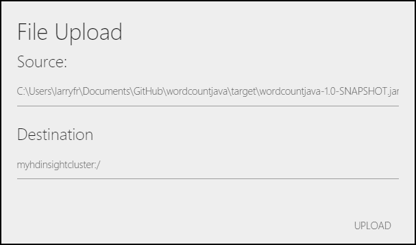

<properties
	pageTitle="在 HDInsight 中上载 Hadoop 作业的数据 | Azure"
	description="了解如何使用 Azure CLI、Azure 存储资源管理器、Azure PowerShell、Hadoop 命令行或 Sqoop 在 HDInsight 中上载和访问 Hadoop 作业的数据。"
	services="hdinsight,storage"
	documentationCenter=""
	tags="azure-portal"
	authors="mumian"
	manager="paulettm"
	editor="cgronlun"/>

<tags
	ms.service="hdinsight"
	ms.date="05/18/2016"
	wacn.date="07/28/2016"/>

#在 HDInsight 中上载 Hadoop 作业的数据

Azure HDInsight 在 Azure Blob 存储之上提供了一个功能完备的 Hadoop 分布式文件系统 (HDFS)。该系统设计为一个 HDFS 扩展，为客户提供无缝体验。它通过启用 Hadoop 生态系统中的整套组件以直接操作其管理的数据。Azure Blob 存储和 HDFS 是独立的文件系统，并且已针对数据的存储和计算进行了优化。有关使用 Azure Blob 存储的益处，请参阅[将 Azure Blob 存储与 HDInsight 配合使用][hdinsight-storage]。

**先决条件**

在开始下一步之前，请注意以下要求：

* 一个 Azure HDInsight 群集。有关说明，请参阅 [Azure HDInsight 入门][hdinsight-get-started]或[预配 HDInsight 群集][hdinsight-provision]。

##什么是 Blob 存储？

通常，为了执行 MapReduce 作业，会部署 Azure HDInsight 群集，一旦这些作业完成，就删除这些群集。在完成计算后将数据保存在 HDFS 群集中是一种成本很高的数据存储方法。对于将使用 HDInsight 处理的数据而言，Azure Blob 存储是一个高度可用的、可高度缩放的、大容量、低成本且可共享的存储选项。在 Blob 中存储数据，可以安全地释放用于计算的 HDInsight 群集而不丢失数据。

###目录

Azure Blob 存储容器将数据存储为键值对，没有目录层次结构。不过，可在键名称中使用“/”字符，使其看起来像存储在目录结构中的文件。HDInsight 将这些字符视为实际的目录。

例如，Blob 的键可以是 *input/log1.txt*。不存在实际的“input”目录，但由于键名称中包含“/”字符，因此使其看起来像一个文件路径。

因此，如果你使用 Azure 资源管理器工具，可以看到一些 0 字节的文件。这些文件有两个作用：

- 在有空文件夹的情况下，它们充当文件夹存在的标记。Azure Blob 存储足够聪明，可以了解如果存在名为 foo/bar 的 blob，就存在一个名为 **foo** 的文件夹。但如果你希望具有一个名为 **foo** 的空文件夹，则指明这一点的唯一方法是放入这个特殊的 0 字节文件。

- 它们具有 Hadoop 文件系统所需的一些特别的元数据，最明显的是文件夹的权限和所有者。

##命令行实用程序

Microsoft 提供了以下实用程序让你使用 Azure Blob 存储：

| 工具 | Linux | OS X | Windows |
| ---- |:-----:|:----:|:-------:|
| [Azure 命令行界面][azurecli] | ✔ | ✔ | ✔ |
| [Azure PowerShell][azure-powershell] | | | ✔ |
| [AzCopy][azure-azcopy] | | | ✔ |
| [Hadoop 命令](#commandline) | ✔ | ✔ | ✔ |

> [AZURE.NOTE] 尽管 Azure CLI、Azure PowerShell 和 AzCopy 都可从 Azure 外部使用，但是 Hadoop 命令只能在 HDInsight 群集上使用，而且只能将数据从本地文件系统加载到 Azure Blob 存储。

### Azure CLI

Azure CLI 是一个跨平台工具，可用于管理 Azure 服务。使用以下步骤将数据上载到 Azure Blob 存储：

[AZURE.INCLUDE [use-latest-version](../../includes/hdinsight-use-latest-cli.md)]

1. [安装和配置适用于 Mac、Linux 和 Windows 的 Azure CLI](/documentation/articles/xplat-cli-install/)。

2. 打开命令提示符、bash 或其他 shell，然后使用以下方法对 Azure 订阅进行身份验证。

		azure config mode asm
		azure account clear
		azure account download -e AzureChinaCloud

		azure account import path/to/<subscription name>-<date>-credentials.publishsettings

3. 使用以下命令，列出订阅的存储帐户：

		azure storage account list

4. 选择包含你要使用的 Blob 的存储帐户，然后使用以下命令检索此帐户的密钥：

		azure storage account keys list <storage-account-name>

	这应会返回**主**密钥和**辅助**密钥。复制**主**密钥值，因为后面的步骤要用到它。

5. 使用以下命令检索存储帐户中的 Blob 容器列表：

		azure storage container list -a <storage-account-name> -k <primary-key>

6. 使用以下命令可将文件上载和下载到 Blob：

	* 上载文件：

			azure storage blob upload -a <storage-account-name> -k <primary-key> <source-file> <container-name> <blob-name>

	* 下载文件：

			azure storage blob download -a <storage-account-name> -k <primary-key> <container-name> <blob-name> <destination-file>

> [AZURE.NOTE] 如果你始终使用同一个存储帐户，可以设置以下环境变量，而无需为每条命令指定帐户和密钥：
>
 * **AZURE\_STORAGE\_ACCOUNT**：存储帐户名称
>
 * **AZURE\_STORAGE\_ACCESS\_KEY**：存储帐户密钥

### Azure PowerShell

Azure PowerShell 是一个脚本编写环境，可用于在 Azure 中控制和自动执行工作负荷的部署和管理。有关配置工作站以运行 Azure PowerShell 的信息，请参阅[安装和配置 Azure PowerShell](/documentation/articles/powershell-install-configure/)。

[AZURE.INCLUDE [use-latest-version](../../includes/hdinsight-use-latest-powershell.md)]

**将本地文件上载到 Azure Blob 存储**

1. 根据[安装和配置 Azure PowerShell](/documentation/articles/powershell-install-configure/) 中的说明打开 Azure PowerShell 控制台。
2. 设置以下脚本中前五个变量的值：

		$subscriptionName = "<AzureSubscriptionName>"
		$resourceGroupName = "<AzureResourceGroupName>"
		$storageAccountName = "<StorageAccountName>"
		$containerName = "<ContainerName>"

		$fileName ="<LocalFileName>"
		$blobName = "<BlobName>"

		Switch-AzureMode -Name AzureResourceManager

		Clear-AzureProfile
		Import-AzurePublishSettingsFile -PublishSettingsFile path/to/<subscription name>-<date>-credentials.publishsettings
		Select-AzureSubscription $subscriptionName

		# Get the storage account key
		$storageaccountkey = get-azurestoragekey -ResourceGroupName $resourceGroupName -Name $storageAccountName | %{$_.Primary}

		# Create the storage context object
		$destContext = New-AzureStorageContext -StorageAccountName $storageAccountName -StorageAccountKey $storageaccountkey

		# Copy the file from local workstation to the Blob container
		Set-AzureStorageBlobContent -File $fileName -Container $containerName -Blob $blobName -context $destContext

3. 将脚本粘贴到 Azure PowerShell 控制台中，以运行它来复制文件。

有关创建用来使用 HDInsight 的 PowerShell 脚本示例，请参阅 [HDInsight 工具](https://github.com/blackmist/hdinsight-tools)。

### AzCopy

AzCopy 是一个命令行工具，用于简化将数据传入和传出 Azure 存储帐户的任务。你可以将它用作独立的工具，也可以将此工具融入到现有应用程序中。[下载 AzCopy][azure-azcopy-download]。

AzCopy 语法为：

	AzCopy <Source> <Destination> [filePattern [filePattern...]] [Options]

有关详细信息，请参阅 [AzCopy - 上载/下载 Azure Blob 的文件][azure-azcopy]。

### Hadoop 命令行

仅当数据已存在于群集头节点中时，才可以使用 Hadoop 命令行将数据存储到 Blob 存储。

若要使用 Hadoop 命令，必须先使用以下方法之一连接到头节点：

* **基于 Windows 的 HDInsight**：[使用远程桌面连接](/documentation/articles/hdinsight-administer-use-management-portal-v1/#connect-to-hdinsight-clusters-by-using-rdp)

连接之后，可以使用以下语法将文件上载到存储。

	hadoop -copyFromLocal <localFilePath> <storageFilePath>

例如 `hadoop fs -copyFromLocal data.txt /example/data/data.txt`

由于 HDInsight 的默认文件系统在 Azure Blob 存储中，/example/data.txt 实际是在 Azure Blob 存储中。你也可以将该文件表示为：

	wasbs:///example/data/data.txt

或

	wasbs://<ContainerName>@<StorageAccountName>.blob.core.chinacloudapi.cn/example/data/davinci.txt

有关其他可用于处理文件的 Hadoop 命令列表，请参阅 [http://hadoop.apache.org/docs/r2.7.0/hadoop-project-dist/hadoop-common/FileSystemShell.html](http://hadoop.apache.org/docs/r2.7.0/hadoop-project-dist/hadoop-common/FileSystemShell.html)

##图形客户端

某些应用程序还提供可配合 Azure 存储空间使用的图形界面。下面是其中一些应用程序的列表：

| 客户端 | Linux | OS X | Windows |
| ------ |:-----:|:----:|:-------:|
| [Azure 存储空间资源管理器](http://storageexplorer.com/) | ✔ | ✔ | ✔ |
| [Cloud Storage Studio 2](http://www.cerebrata.com/Products/CloudStorageStudio/) | | | ✔ |
| [CloudXplorer](http://clumsyleaf.com/products/cloudxplorer) | | | ✔ |
| [Azure 资源管理器](http://www.cloudberrylab.com/free-microsoft-azure-explorer.aspx) | | | ✔ |
| [Zudio](https://zudio.co/) | ✔ | ✔ | ✔ |
| [Cyberduck](https://cyberduck.io/) | | ✔ | ✔ |

### Azure 存储空间资源管理器

*Azure 存储资源管理器*是用于在 Blob 中检查和更改数据的有用工具。它是一个免费的开源工具，可从 [http://storageexplorer.com/](http://storageexplorer.com/) 下载。也可以从此链接获取源代码。

使用该工具之前，你必须知道你的 Azure 存储帐户名和帐户密钥。有关如何获取此信息的说明，请参阅[创建、管理或删除存储帐户][azure-create-storage-account]中的“如何：查看、复制和重新生成存储访问密钥”部分。

1. 运行 Azure 存储空间资源管理器。如果这是你第一次运行存储资源管理器，系统将提示你输入“存储帐户名”和“存储帐户密钥”。如果你以前运行过存储资源管理器，请使用“添加”按钮添加一个新的存储帐户名和密钥。

    输入 HDinsight 群集使用的存储帐户的名称和密钥，然后选择“保存并打开”。

	![HDI.AzureStorageExplorer][image-azure-storage-explorer]

5. 在界面左侧的容器列表中，单击与你的 HDInsight 群集关联的容器名称。默认情况下，这是 HDInsight 群集的名称，但如果你在创建群集时输入了特定的名称，则该名称可能不同。

6. 在工具栏中选择上载图标。

    

7. 指定要上载的文件，然后单击“打开”。出现提示时，请选择“上载”将文件上载到存储容器的根目录。如果要将文件上载到特定的路径，请在“目标”字段中输入该路径，然后选择“上载”。

    
    
    上载完文件后，可以通过 HDInsight 群集中的作业来使用该文件。

##将 Azure Blob 存储装载为本地驱动器

请参阅[将 Azure Blob 存储装载为本地驱动器](http://blogs.msdn.com/b/bigdatasupport/archive/2014/01/09/mount-azure-blob-storage-as-local-drive.aspx)。

##服务

### Apache Sqoop

Sqoop 是一种为在 Hadoop 和关系数据库之间传输数据而设计的工具。可以使用此工具将数据从关系数据库管理系统 (RDBMS)（如 SQL Server、MySQL 或 Oracle）中导入到 Hadoop 分布式文件系统 (HDFS)，在 Hadoop 中使用 MapReduce 或 Hive 转换数据，然后回过来将数据导出到 RDBMS。

有关详细信息，请参阅[将 Sqoop 与 HDInsight 配合使用][hdinsight-use-sqoop]。

##开发 SDK

还可以使用 Azure SDK 通过以下编程语言来访问 Azure Blob 存储：

* .NET
* Java
* Node.js
* PHP
* Python
* Ruby

有关安装 Azure SDK 的详细信息，请参阅 [Azure 下载](/downloads/)

## 后续步骤
现在，你已了解如何将数据导入 HDInsight，请阅读以下文章了解如何执行分析：

* [Azure HDInsight 入门][hdinsight-get-started]
* [以编程方式提交 Hadoop 作业][hdinsight-submit-jobs]
* [将 Hive 与 HDInsight 配合使用][hdinsight-use-hive]
* [将 Pig 与 HDInsight 配合使用][hdinsight-use-pig]

[azure-management-portal]: https://manage.windowsazure.cn
[azure-powershell]: http://msdn.microsoft.com/zh-cn/library/azure/jj152841.aspx

[azure-storage-client-library]: /documentation/articles/storage-dotnet-how-to-use-blobs/
[azure-create-storage-account]: /documentation/articles/storage-create-storage-account/
[azure-azcopy-download]: /documentation/articles/storage-use-azcopy/
[azure-azcopy]: /documentation/articles/storage-use-azcopy/

[hdinsight-use-sqoop]: /documentation/articles/hdinsight-use-sqoop/

[hdinsight-storage]: /documentation/articles/hdinsight-hadoop-use-blob-storage/
[hdinsight-submit-jobs]: /documentation/articles/hdinsight-submit-hadoop-jobs-programmatically/
[hdinsight-get-started]: /documentation/articles/hdinsight-hadoop-tutorial-get-started-windows-v1/

[hdinsight-use-hive]: /documentation/articles/hdinsight-use-hive/
[hdinsight-use-pig]: /documentation/articles/hdinsight-use-pig/
[hdinsight-provision]: /documentation/articles/hdinsight-provision-clusters-v1/

[sqldatabase-create-configure]: /documentation/articles/sql-database-get-started/

[apache-sqoop-guide]: http://sqoop.apache.org/docs/1.4.4/SqoopUserGuide.html

[Powershell-install-configure]: /documentation/articles/powershell-install-configure/

[azurecli]: /documentation/articles/xplat-cli-install/

[image-azure-storage-explorer]: ./media/hdinsight-upload-data/HDI.AzureStorageExplorer.png
[image-ase-addaccount]: ./media/hdinsight-upload-data/HDI.ASEAddAccount.png
[image-ase-blob]: ./media/hdinsight-upload-data/HDI.ASEBlob.png

<!---HONumber=Mooncake_0215_2016-->