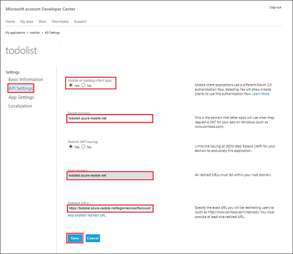
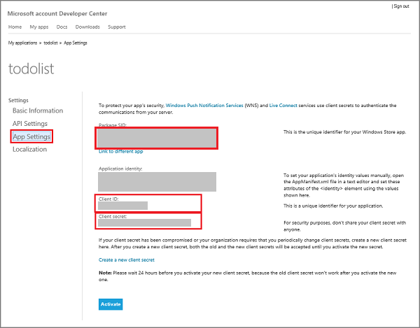

<properties 
	pageTitle="注册以进行 Microsoft 身份验证 | Microsoft Azure" 
	description="了解如何在 Azure 移动服务应用程序中注册以进行 Microsoft 身份验证。" 
	authors="ggailey777" 
	services="mobile-services" 
	documentationCenter="Mobile" 
	manager="dwrede" 
	editor=""/>

<tags 
	ms.service="mobile-services" 
	ms.date="02/25/2016" 
	wacn.date="04/11/2016"/>

# 注册应用程序以使用 Microsoft 帐户进行身份验证

[AZURE.INCLUDE [mobile-services-selector-register-identity-provider](../../includes/mobile-services-selector-register-identity-provider.md)]

## 概述 

本主题说明如何注册你的移动应用程序，以便能够使用 Microsoft 帐户作为 Azure 移动服务的标识提供程序。以下步骤同样适用于使用 Live SDK 的服务导向型身份验证和客户端导向型身份验证。

##在 Windows 开发人员中心注册 Windows 应用商店应用程序

首先必须在 Windows 开发人员中心注册 Windows 应用商店应用程序。通过注册，Windows 应用将能够使用单一登录行为。

>[AZURE.NOTE]Windows Phone 8、Windows Phone 8.1 Silverlight 和非 Windows 应用程序可以跳过本部分。

1. 如果尚未注册应用，请导航到 [Windows 开发人员中心](https://dev.windows.com/dashboard/Application/New)，使用你的 Microsoft 帐户登录，键入应用的名称，然后单击“保留应用名称”。
 
3. 在 Visual Studio 中打开你的 Windows 应用项目，然后在“解决方案资源管理器”中，右键单击 Windows 应用商店应用项目，并单击“应用商店”>“将应用与应用商店关联...”。

  	

5. 在向导中，单击“登录”，使用你的 Microsoft 帐户登录，选择你保留的应用名称，然后单击“下一步”>“关联”。

6. （可选）对于通用 Windows 8.1 应用，请重复适用于 Windows Phone 应用商店项目的步骤 4 和 5。

6. 回到新应用的“Windows 开发人员中心”页，单击“服务”>“推送通知”。

7. 在“推送通知”页中，在“Windows 推送通知服务(WNS)和 Microsoft Azure 移动服务”下面单击“Live Services 站点”。
 
	此时将显示应用的 Microsoft 帐户应用设置页。

8. 记下“程序包 SID”值。可以将此 SID 保存在 Azure 门户以便为你的 Windows 应用启用单一登录和推送通知。

接下来，你会从下一部分中的步骤 4 开始，为你的 Windows 应用配置 Microsoft 帐户身份验证。

## 配置你的 Microsoft 帐户注册，然后连接到移动服务

如果你已在上一部分中注册了 Windows 应用，则可以跳到步骤 2。

1. 对于非 Windows 应用商店应用程序，请导航到 Microsoft 帐户开发人员中心的“[我的应用程序](http://go.microsoft.com/fwlink/p/?LinkId=262039)”页，使用你的 Microsoft 帐户登录（如果需要），单击“创建应用程序”，键入**应用程序名称**，然后单击“我接受”。

   	这将会通过 Microsoft 帐户为你保留应用程序名称，并显示应用程序的 Microsoft 帐户页。

2. 在应用程序的 Microsoft 帐户页上，单击“API 设置”，启用“移动或桌面客户端应用程序”，将移动服务 URL 设为“目标域”，在“重定向 URL”中提供以下 URL 格式之一，然后单击“保存”：

	+ **.NET 后端**：`https://<mobile_service>.azure-mobile.net/signin-microsoft`
	+ **JavaScript 后端**：`https://<mobile_service>.azure-mobile.net/login/microsoftaccount` 

	 >[AZURE.NOTE]确保根据移动服务后端的类型使用正确的重定向 URL 路径格式。如果格式不正确，身份验证将不会成功。“根域”应会自动填入。

    

4. 单击“应用程序设置”，并记下“客户端 ID”、“客户端机密”和“包 SID”的值。
	
   	

    > [AZURE.NOTE]客户端密钥是一个非常重要的安全凭据。请勿与任何人分享客户端密钥或将密钥随应用程序分发。只有 Windows 应用商店应用程序注册才能看到“包 SID”字段。

4. 在 [Azure 经典管理门户]中，单击移动服务的“标识”选项卡，输入从标识提供者获取的客户端 ID、客户端机密和包 SID，然后单击“保存”。

	>[AZURE.NOTE]对于 Windows Phone 8、Windows Phone 应用商店 8.1 Silverlight 或非 Windows 应用程序，不需提供包 SID 值。
	
现在，你的移动服务和应用程序都已配置为使用 Microsoft 帐户。

<!-- Anchors. -->

<!-- Images. -->

<!-- URLs. -->

[Submit an app page]: http://go.microsoft.com/fwlink/p/?LinkID=266582
[My Applications]: http://go.microsoft.com/fwlink/p/?LinkId=262039

[Azure 经典管理门户]: https://manage.windowsazure.cn/

<!---HONumber=Mooncake_0118_2016-->