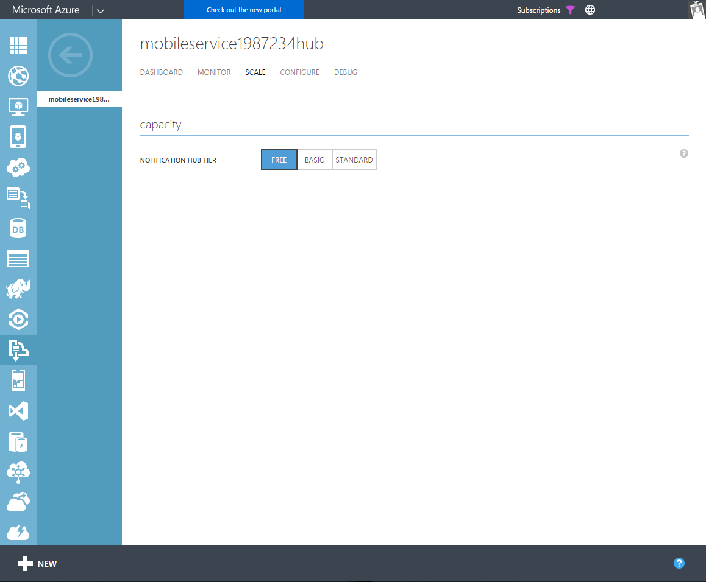

<properties
	pageTitle="Azure 通知中心 - 常见问题 (FAQ)"
	description="关于设计/实现有关通知中心的解决方案的常见问题"
	services="notification-hubs"
	documentationCenter="mobile"
	authors="wesmc7777"
	manager="dwrede"
    keywords="推送通知, 推送通知, iOS 推送通知, android 推送通知, ios 推送, android 推送"
	editor="" />

<tags
	ms.service="notification-hubs"
	ms.date="03/09/2016"
	wacn.date="07/12/2016"/>

#使用 Azure 通知中心推送通知 — 常见问题

##常规
###1\.通知中心的价格模型有哪些？
通知中心按三层提供：

* **免费** — 每个订阅一个月可获得最多 100 万次推送。
* **基本** — 每个订阅一个月可获得 1000 万次推送作为基准，具有配额增长选项。
* **标准** — 每个订阅一个月可获得 1000 万次推送作为基准，具有配额增长选项，再加上丰富的遥测功能。

你可以在[通知中心定价]页面找到最新的详细信息。定价根据订阅级别制定，并以推送通知起始次数为基础，因此，在 Azure 订阅中创建的命名空间或通知中心的多少与此无关。

**免费层**适用于没有 SLA 保证的开发目的。对于那些想要通过 Azure 通知中心了解推送通知功能的用户，虽然这一层可能是个不错的起点，但可能不是中型到大型应用程序的最佳选择。

**基本**和**标准**层适用于具有以下仅针对标准层启用的关键特性的生产使用情况：

- 丰富的遥测 — 通知中心提供许多功能，可导出遥测数据以及推送通知注册信息，以供脱机查看和分析。
- 多租户 — 如果要使用通知中心创建移动应用以支持多个租户，则适合使用此功能。这使你可以在应用的通知中心命名空间级别设置推送通知服务 (PNS) 凭据，然后可以分隔租户以在此公共命名空间下向他们提供单个中心。这样便于维护，同时保存这些 SAS 密钥以从这些针对各个租户分隔的通知中心发送和接收推送通知，确保不会出现跨租户重叠。
- 计划推送 — 允许你计划推送通知，而推送通知随后会排入队列并发送出去。
- 批量导入 — 允许你批量导入注册。

###2\.什么是通知中心 SLA？
对于**基本**和**标准**通知中心层，就在受支持的层内部署的通知中心而言，我们保证至少在 99.9% 的情况下，正确配置的应用程序将能够发送推送通知或执行注册管理操作。若要详细了解我们的 SLA，请访问[通知中心 SLA]页面。

> [AZURE.NOTE] 由于通知中心依赖于外部平台提供商将推送通知传递到设备，因此平台通知服务和设备之间没有用于支撑的 SLA 保证。

###3\.哪些客户在使用通知中心？
我们有许多客户在使用通知中心，以下是几位著名客户：

* Sochi 2014 — 数百个兴趣组、300 多万台设备、2 周内发出的通知超过了 1.5 亿条。[案例研究 - Sochi]
* Skanska - [案例研究 - Skanska]
* Seattle Times - [案例研究 - Seattle Times]
* Mural.ly - [案例研究 -Mural.ly]
* 7Digital - [案例研究 - 7Digital]
* 必应应用 — 数千万台设备，每天发送 300 万条以上的通知。

###4\.如何升级或降级通知中心以更改我的服务层？
转到 [Azure 经典门户]，然后依次单击“服务总线”、你的命名空间和你的通知中心。在“缩放”选项卡中，可以更改你的通知中心服务层。

##设计和开发
###1\.支持哪些服务器端平台？
我们针对 .NET、Java、PHP、Python、Node.js 提供有 SDK 和[完整的示例]，因此，你可设置应用后端以使用这些平台中的任一个与通知中心通信。通知中心 API 以 REST 接口为基础，因此，如果你不想增加额外的依赖项，可以选择直接与其通信。你可以在 [NH — REST API] 页面找到更多详细信息。

###2\.支持哪些客户端平台？
我们支持将推送通知发送到 [Apple iOS](/documentation/articles/notification-hubs-ios-apple-push-notification-apns-get-started)、[Windows 通用](/documentation/articles/notification-hubs-windows-store-dotnet-get-started-wns-push-notification)、[Windows Phone](/documentation/articles/notification-hubs-windows-mobile-push-notifications-mpns)、[Kindle](/documentation/articles/notification-hubs-kindle-amazon-adm-push-notification)、[Android China（通过百度）](/documentation/articles/notification-hubs-baidu-china-android-notifications-get-started)、Xamarin ([iOS](/documentation/articles/xamarin-notification-hubs-ios-push notification-apns-get-started) 和 [Safari](https://github.com/Azure/azure-notificationhubs-samples/tree/master/PushToSafari) 平台。有关在这些平台上发送推送通知的入门教程的完整列表，请访问 [NH - Getting Started Tutorials（NH — 入门教程）]页面。

###3\.是否支持 SMS/电子邮件/Web 通知？
通知中心主要针对使用上面列出的平台将通知发送到移动应用而设计。我们目前不提供发送电子邮件或短信提示的功能；但提供这些功能的第三方平台可以与通知中心进行集成，以通过使用 [Azure Mobile Apps] 发送原生推送通知。

通知中心也不提供现成的浏览器内推送通知传递服务。客户可以在支持的服务器端平台上，选择使用 SignalR 来实现此功能。
###4\.Azure Mobile Apps 与 Azure 通知中心之间的关系如何？它们各自适用于什么场合？
如果你有现成的移动应用后端并且只想添加发送推送通知的功能，则可以使用 Azure 通知中心。如果你想要从头开始安装移动应用后端，那么你应当考虑使用 Azure Mobile Apps。Azure Mobile Apps 会自动预配通知中心，以便你能够轻松地从移动应用后端发送推送通知。Azure Mobile Apps 的定价包括通知中心的基本费用，你只需在超出所含推送时支付费用。你可以在 [App Service 定价]页面找到有关成本的更多详细信息。

###5\.如果通过通知中心发送推送通知，可以支持多少个设备？
有关支持的设备数目的详细信息，请参阅[通知中心定价]页面。

在某些情况下，如果你需要支持超过 10,000,000 个已注册的设备，请直接与我们联系，我们将帮你扩展你的解决方案。

###6\.我可以发送多少推送通知？
Azure 会根据系统中通过的通知数量自动向上扩展，具体取决于所选的层。

>[AZURE.NOTE] 整体使用成本可能会根据目前提供的推送通知数量而增加。请务必留意[通知中心定价]页面上概述的现有层限制。

我们现有的客户每天使用通知中心发送数百万条推送通知。只要使用 Azure 通知中心，你就不需要执行任何特别的操作来调整推送通知可及范围。

###7\.已发送的推送通知到达我的设备需要多长时间？
在正常使用情况下，Azure 通知中心能够在 1 分钟内处理至少 **100 万次推送通知发送**，其中传入负载相当一致，本质上不会出现猛增现象。此速率可能因标记数、传入发送的性质以及其他外部因素而有所不同。

在预计的传递时间内，服务能计算每个平台的目标，并根据注册的标记/标记表达式将消息路由到各自的推送通知传递服务。然后，由推送通知服务 (PNS) 负责将通知发送到设备。

PNS 对于传递通知不保证任何 SLA；但是，一般情况下，绝大多数推送通知会在发送到我们的平台之后的数分钟内（通常在 10 分钟的限制内）传递到目标设备。可能存在少量可能需要更多时间的异常消息。

>[AZURE.NOTE] Azure 通知中心有一个策略，可删除任何不能在 30 分钟内传递到 PNS 的推送通知。这一延迟的出现原因有多种，最常见的是因为 PNS 限制了你的应用程序。

###8\.是否有任何延迟保证？
推送通知的特性（由平台特定的外部推送通知服务传递）导致没有延迟保证。通常情况下，大部分推送通知会在几分钟内完成传递。

###9\.我在设计包含命名空间和通知中心的解决方案时需要考虑哪些因素？

####移动应用/环境

* 每个环境中的每个移动应用只应有一个通知中心。
* 在多租户方案中，每个租户都应具有一个单独的中心。
* 你不能在测试与生产环境之间共享同一通知中心，因为这可能导致发送通知时出现问题，例如，Apple 提供沙盒和每个都具有单独凭据的生产推送终结点。
* 默认情况下，你可以通过 Azure 门户或 Visual Studio 中的 Azure 集成组件将测试通知发送到已注册的设备。阈值设置为从注册池中随机选取的 10 个设备。

>[AZURE.NOTE] 如果中心最初的配置使用的是 Apple 沙盒证书，而后又使用 Apple 生产证书进行了重新配置，则旧的设备令牌将和新证书一起失效，导致推送失败。将生产和测试环境分开，针对不同的环境使用不同的中心是最佳做法。

####PNS 凭据

将移动应用注册到某个平台的开发人员门户（如Apple 或 Google 等）后，你会获得应用标识符和安全令牌，应用后端需要向平台的推送通知服务提供这些信息才能将推送通知发送到设备。必须在通知中心配置这些安全令牌，其形式可以是证书（例如，对于 Apple iOS 或 Windows Phone）或安全密钥（Google Android、Windows 等等）。这通常在通知中心级别完成，在多租户方案中，也可在命名空间级别完成。

####命名空间

命名空间可用于部署分组。在多租户方案中，还可以用它来表示同一应用的所有租户的所有通知中心。

####地理分布

在推送通知方案中，地理分布并非总是关键所在。请注意，各种最终将推送通知传递至设备的推送通知服务（如 APNS、GCM 等）并不是均匀分布的。

如果你有一个在全球范围内使用的应用程序，那么你可以在不同的命名空间内创建若干中心，以利用全球不同 Azure 区域中可用的通知中心服务。

>[AZURE.NOTE] 这将增加管理成本，尤其是注册方面，因此不建议如此，仅在明确需要时采用此方法。

###10\.我该从应用后端注册还是直接通过客户端设备注册？
在创建注册之前，当你必须进行客户端身份验证时，或者，当你拥有必须根据某些应用逻辑由应用后端创建或修改的标记时，从应用后端进行注册很有用。有关详细信息，你可以通过[后端注册指南]与[后端注册指南 — 2] 页面深入了解。

###11\.什么是推送通知传递安全模型？
Azure 通知中心使用基于[共享访问签名 (SAS)](/documentation/articles/storage-dotnet-shared-access-signature-part-1) 的安全模型。你可以在根命名空间级别或细粒度通知中心级别使用 SAS 令牌。这些 SAS 令牌可以使用不同的授权规则进行设置，如发送消息权限、侦听通知权限等。你可以在 [NH 安全模型]文档中找到更多详细信息。

###12\.我如何处理推送通知中的敏感负载？
所有通知都由平台的推送通知服务 (PNS) 传递到目标设备。当发件人将通知发送到 Azure 通知中心后，我们会对通知进行处理并传递到各自的 PNS。

从发送方到 Azure 通知中心、而后再到 PNS 的所有连接都使用 HTTPS。

>[AZURE.NOTE] Azure 通知中心不会以任何方式记录消息的负载。

但是，对于发送敏感负载，建议使用安全推送模式，在该模式下，发送者将带有消息标识符的“ping”通知传递到设备，其中不包含敏感负载，当设备上的应用接收到此负载后，它能够直接调用安全 API 来提取消息详细信息。你可以在 [NH — 安全推送教程]页面找到有关如何实现上述模式的指南。

##操作
###1\.什么是灾难恢复 (DR) 情景？
我们这边提供元数据灾难恢复范围（通知中心名称、连接字符串和其他重要信息）。触发 DR 方案后，注册数据是通知中心基础结构中唯一会丢失的**片段**。你必须实施解决方案，将此数据重新填充到恢复后的新中心。

- 步骤 1 — 在另一个数据中心创建辅助通知中心。你可以在发生 DR 事件时动态创建此辅助中心，也可以在一开始就创建一个。无论选择哪一个选项都没有很大的差别，因为通知中心预配是一个相对较快的过程，大约只需要数秒的时间。一开始就创建好辅助中心将能避免 DR 事件影响到你的管理能力，因此强烈建议你这样做。

- 步骤 2 - 使用主通知中心的注册信息冻结辅助通知中心。建议不要尝试同时在两个中心上维护注册信息，并在收到注册信息时在两个中心之间动态同步，由于注册信息会在 PNS 端到期这一固有性质，这个方式通常效果不佳。在我们收到 PNS 关于过期的或无效注册的反馈后，通知中心会将这些注册信息清除。

建议使用具有以下功能之一的应用后端：

- 在其一端维护一组给定的注册信息，以便其可以在发生 DR 时将这些信息批量插入辅助通知中心

**或者**

- 从主中心获取注册信息的常规转储作为备份，然后批量插入辅助 NH。

>\[AZURE.NOTE\] [注册信息导出/导入]文档中介绍了标准层提供的注册信息导出/导入功能。

如果你没有后端，则当应用在任何目标设备上启动时，它们将在辅助通知中心执行新注册，最后，辅助通知中心将拥有所有已注册的活动设备。

缺点是设备上的应用未启动期间将不会接收通知。

###2\.是否有任何审核日志功能？
有关所有通知中心管理操作，请转到 [Azure 经典门户]中公开的操作日志。

##监视与故障排除
###1\.故障排除功能有哪些？
Azure 通知中心提供多种可执行常见故障排除的功能，特别是在有关已删除通知的最常见情况中。有关详细信息，请参阅 [NH — 故障排除]白皮书。

###2\.遥测功能有哪些？
Azure 通知中心支持在 [Azure 经典门户]中查看遥测数据。你可以在 [NH — 指标]页面找到有关可用指标的详细信息。

>[AZURE.NOTE] 成功的通知仅表示推送通知已传递到外部推送通知服务（例如 Apple 的 APNS、Google 的 GCM 等等）。由 PNS 负责将通知传递到目标设备。PNS 通常不会向第三方公开传递指标。

我们还提供了以编程方式导出遥测数据的功能（在**标准**层）。有关详细信息，请参阅 [NH — 指标示例]。

[Azure 经典门户]: https://manage.windowsazure.cn
[通知中心定价]: /pricing/details/notification-hubs/
[通知中心 SLA]: /support/legal/sla/
[案例研究 - Sochi]: https://customers.microsoft.com/Pages/CustomerStory.aspx?recid=7942
[案例研究 - Skanska]: https://customers.microsoft.com/Pages/CustomerStory.aspx?recid=5847
[案例研究 - Seattle Times]: https://customers.microsoft.com/Pages/CustomerStory.aspx?recid=8354
[案例研究 -Mural.ly]: https://customers.microsoft.com/Pages/CustomerStory.aspx?recid=11592
[案例研究 - 7Digital]: https://customers.microsoft.com/Pages/CustomerStory.aspx?recid=3684
[NH — REST API]: https://msdn.microsoft.com/library/azure/dn530746.aspx
[NH - Getting Started Tutorials（NH — 入门教程）]: /documentation/articles/notification-hubs-ios-apple-push-notification-apns-get-started/
[Mobile Services Pricing]: /pricing/details/mobile-services/
[后端注册指南]: https://msdn.microsoft.com/library/azure/dn743807.aspx
[后端注册指南 — 2]: https://msdn.microsoft.com/library/azure/dn530747.aspx
[NH 安全模型]: https://msdn.microsoft.com/library/azure/dn495373.aspx
[NH — 安全推送教程]: /documentation/articles/notification-hubs-aspnet-backend-ios-push-apple-apns-secure-notification/
[NH — 故障排除]: /documentation/articles/notification-hubs-push-notification-fixer/
[NH — 指标]: https://msdn.microsoft.com/library/dn458822.aspx
[NH — 指标示例]: https://github.com/Azure/azure-notificationhubs-samples/tree/master/FetchNHTelemetryInExcel
[注册信息导出/导入]: https://msdn.microsoft.com/library/dn790624.aspx
[Azure Portal]: https://portal.azure.cn
[完整的示例]: https://github.com/Azure/azure-notificationhubs-samples
[Azure Mobile Apps]: /services/mobile-services/
[App Service 定价]: /pricing/details/mobile-services/

<!---HONumber=Mooncake_0704_2016-->