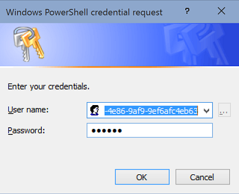

<properties
   pageTitle="使用 PowerShell 创建 AD 应用程序 | Azure"
   description="描述如何使用 Azure PowerShell 创建 Active Directory 应用程序，并通过基于角色的访问控制授予它对资源的访问权限。它演示如何使用密码或证书对应用程序进行身份验证。"
   services="azure-resource-manager"
   documentationCenter="na"
   authors="tfitzmac"
   manager="timlt"
   editor="tysonn"/>

<tags
   ms.service="azure-resource-manager"
   ms.date="06/13/2016"
   wacn.date=""/>
# 使用 Azure PowerShell 创建可访问资源的 Active Directory 应用程序

> [AZURE.SELECTOR]
- [PowerShell](/documentation/articles/resource-group-authenticate-service-principal)
- [Azure CLI](/documentation/articles/resource-group-authenticate-service-principal-cli)
- [门户](/documentation/articles/resource-group-create-service-principal-portal)

本主题演示如何使用 [Azure PowerShell](/documentation/articles/powershell-install-configure) 创建 Active Directory (AD) 应用程序，如可访问你的订阅中的其他资源的自动化进程、应用程序或服务。借助 Azure Resource Manager，可以使用基于角色的访问控制向应用程序授予允许的操作。

在本文中，你将创建两个对象 - AD 应用程序和服务主体。AD 应用程序位于注册了应用的租户中，并定义了要运行的进程。服务主体包含 AD 应用程序的标识，并用于分配权限。从 AD 应用程序可以创建多个服务主体。有关应用程序和服务主体的详细说明，请参阅[应用程序对象和服务主体对象](/documentation/articles/active-directory-application-objects)。有关 Active Directory 身份验证的详细信息，请参阅 [Azure AD 的身份验证方案](/documentation/articles/active-directory-authentication-scenarios)。

有 2 个选项用于验证应用程序：

 - 密码 - 当用户想要在执行期间以交互方式登录时适用
 - 证书 - 适用于必须无需用户交互进行身份验证的无人参与脚本

## 创建使用密码的 AD 应用程序

在此部分中，你将执行相应步骤来创建使用密码的 AD 应用程序。

1. 登录到你的帐户。

        Add-AzureRmAccount -EnvironmentName AzureChinaCloud

1. 通过提供应用程序的显示名称、描述应用程序的页面的 URI（该链接未验证）、标识应用程序的 URI，以及应用程序标识的密码来创建新的 Active Directory 应用程序。

        $azureAdApplication = New-AzureRmADApplication -DisplayName "exampleapp" -HomePage "https://www.contoso.org" -IdentifierUris "https://www.contoso.org/example" -Password "<Your_Password>"

     检查新的应用程序对象。

        $azureAdApplication
        
     请特别注意 **ApplicationId** 属性，需要使用该属性来创建服务主体、进行角色分配以及获取访问令牌。

        DisplayName             : exampleapp
        Type                    : Application
        ApplicationId           : 8bc80782-a916-47c8-a47e-4d76ed755275
        ApplicationObjectId     : c95e67a3-403c-40ac-9377-115fa48f8f39
        AvailableToOtherTenants : False
        AppPermissions          : {}
        IdentifierUris          : {https://www.contoso.org/example}
        ReplyUrls               : {}

### 创建服务主体，并将其分配给角色

必须从 AD 应用程序创建服务主体，并为其分配角色。

1. 通过传入 Active Directory 应用程序的应用程序 ID 创建应用程序的服务主体。

        New-AzureRmADServicePrincipal -ApplicationId $azureAdApplication.ApplicationId

2. 向服务主体授予对你的订阅的权限。在此示例中，你将要向服务主体授予读取订阅中所有资源的权限。对于 **ServicePrincipalName** 参数，请提供你在创建应用程序时使用的 **ApplicationId** 或 **IdentifierUris**。有关基于角色的访问控制的详细信息，请参阅 [Azure 基于角色的访问控制](./active-directory/role-based-access-control-configure.md)。

        New-AzureRmRoleAssignment -RoleDefinitionName Reader -ServicePrincipalName $azureAdApplication.ApplicationId.Guid

### 通过 PowerShell 手动提供凭据

你已创建 Active Directory 应用程序并为该应用程序创建服务主体。你已向角色分配服务主体。现在，你需要以应用程序身份登录以执行相应操作。在执行按需脚本或命令时，可以手动为应用程序提供凭据。

1. 运行 **Get-Credential** 命令，以创建包含你的凭据的新 **PSCredential** 对象。

        $creds = Get-Credential

2. 系统会提示你输入凭据。对于用户名，请使用你在创建应用程序时所用的 **ApplicationId** 或 **IdentifierUris**。对于密码，请使用你在创建帐户时指定的密码。

     

3. 检索在其中创建了角色分配的订阅。将使用此订阅来获取服务主体角色分配所在租户的 **TenantId**。

        $subscription = Get-AzureRmSubscription

     如果你的帐户链接到多个订阅，请提供订阅名称或 ID，以便获取你要使用的订阅。
     
        $subscription = Get-AzureRmSubscription -SubscriptionName "Azure MSDN - Visual Studio Ultimate"

4. 通过指定此帐户为服务主体并提供凭据对象来以服务主体身份登录。

        Add-AzureRmAccount -Credential $creds -ServicePrincipal -TenantId $subscription.TenantId
        
     现在，你已作为所创建 Active Directory 应用程序的服务主体进行身份验证。

5. 若要在以后的会话中使用当前访问令牌，可以保存该配置文件。

        Save-AzureRmProfile -Path c:\Users\exampleuser\profile\exampleSP.json
        
     可以打开该配置文件，并检查其内容。请注意，它包含访问令牌。
        
6. 下次你想要以服务主体身份执行代码时不必再次登录，只需加载配置文件即可。

        Select-AzureRmProfile -Path c:\Users\exampleuser\profile\exampleSP.json
        
> [AZURE.NOTE] 访问令牌会过期，因此使用保存的配置文件仅适合在令牌有效期间使用。若要永久运行无人参与的脚本，请使用证书。
        
## 创建使用证书的 AD 应用程序

在此部分中，你将执行相应步骤来创建使用证书的 AD 应用程序。

1. 创建自签名证书。如果你使用 Windows 10 或 Windows Server 2016 Technical Preview，请运行以下命令： 

        $cert = New-SelfSignedCertificate -CertStoreLocation "cert:\CurrentUser\My" -Subject "CN=exampleapp" -KeySpec KeyExchange
       
     你将收到有关证书的信息，包括指纹。
     
        Directory: Microsoft.PowerShell.Security\Certificate::CurrentUser\My

        Thumbprint                                Subject
        ----------                                -------
        724213129BD2B950BB3F64FAB0C877E9348B16E9  CN=exampleapp

     如果你未使用 Windows 10 或 Windows Server 2016 Technical Preview，请下载[自签名证书生成器](https://gallery.technet.microsoft.com/scriptcenter/Self-signed-certificate-5920a7c6) PowerShell 脚本。运行以下命令以生成证书。
     
        Import-Module -Name c:\New-SelfSignedCertificateEx.ps1
        New-SelfSignedCertificateEx -Subject "CN=exampleapp" -KeySpec "Exchange" -FriendlyName "exampleapp"
        $cert = Get-ChildItem -Path cert:\CurrentUser\My* -DnsName exampleapp

2. 从证书检索密钥值。

        $keyValue = [System.Convert]::ToBase64String($cert.GetRawCertData())

3. 登录到你的 Azure 帐户。

        Add-AzureRmAccount

4. 在目录中创建一个应用程序。

        $azureAdApplication = New-AzureRmADApplication -DisplayName "exampleapp" -HomePage "https://www.contoso.org" -IdentifierUris "https://www.contoso.org/example" -KeyValue $keyValue -KeyType AsymmetricX509Cert -EndDate $cert.NotAfter -StartDate $cert.NotBefore      
        
    检查新的应用程序对象。

        $azureAdApplication

    请注意 **ApplicationId** 属性，需要使用该属性来创建服务主体、进行角色分配以及获取访问令牌。

        DisplayName             : exampleapp
        Type                    : Application
        ApplicationId           : 1975a4fd-1528-4086-a992-787dbd23c46b
        ApplicationObjectId     : 9665e5f3-84b7-4344-92e2-8cc20ad16a8b
        AvailableToOtherTenants : False
        AppPermissions          : {}
        IdentifierUris          : {https://www.contoso.org/example}
        ReplyUrls               : {}    

### 创建服务主体，并将其分配给角色

1. 通过传入 Active Directory 应用程序的应用程序 ID 创建应用程序的服务主体。

        New-AzureRmADServicePrincipal -ApplicationId $azureAdApplication.ApplicationId

2. 向服务主体授予对你的订阅的权限。在此示例中，你将要向服务主体授予读取订阅中所有资源的权限。对于 **ServicePrincipalName** 参数，请提供你在创建应用程序时使用的 **ApplicationId** 或 **IdentifierUris**。有关基于角色的访问控制的详细信息，请参阅 [Azure 基于角色的访问控制](./active-directory/role-based-access-control-configure.md)。

        New-AzureRmRoleAssignment -RoleDefinitionName Reader -ServicePrincipalName $azureAdApplication.ApplicationId.Guid

### 准备脚本的值

在脚本中，将传入以服务主体身份登录所需的三个值。你将需要：

- 应用程序 ID
- 租户 ID 
- 证书指纹

你已在前面的步骤中看到应用程序 ID 和证书指纹。但是，如果需要以后检索这些值，相应命令将与用于获取租户 ID 的命令一起显示在下面。

1. 若要检索租户 ID，请使用：

        (Get-AzureRmSubscription).TenantId 

    或者，如果你有多个订阅，请提供订阅的名称：

        (Get-AzureRmSubscription -SubscriptionName "Azure MSDN - Visual Studio Ultimate").TenantId
        
2. 若要检索应用程序 ID，请使用：

        (Get-AzureRmADApplication -IdentifierUri "https://www.contoso.org/example").ApplicationId
        
3. 若要检索证书指纹，请使用：

        (Get-ChildItem -Path cert:\CurrentUser\My* -DnsName exampleapp).Thumbprint

### 通过自动执行的 PowerShell 脚本提供证书

你已创建 Active Directory 应用程序并为该应用程序创建服务主体。你已向角色分配服务主体。现在，你需要以服务主体身份登录，以便以服务主体身份执行操作。

若要在脚本中进行身份验证，请指定帐户为服务主体，并提供证书指纹、应用程序 ID 和租户 ID。

    Add-AzureRmAccount -ServicePrincipal -CertificateThumbprint {thumbprint} -ApplicationId {applicationId} -TenantId {tenantid}

现在，你已作为所创建 Active Directory 应用程序的服务主体进行身份验证。

## 后续步骤
  
- 有关 .NET 身份验证示例，请参阅 [Azure Resource Manager SDK for .NET](/documentation/articles/resource-manager-net-sdk/)。
- 有关 Java 身份验证示例，请参阅 [Azure Resource Manager SDK for Java](/documentation/articles/resource-manager-java-sdk/)。 
- 有关 Python 身份验证示例，请参阅 [Resource Management Authentication for Python（适用于 Python 的资源管理身份验证）](https://azure-sdk-for-python.readthedocs.io/en/latest/resourcemanagementauthentication.html)。
- 有关 REST 身份验证示例，请参阅 [Resource Manager REST API](/documentation/articles/resource-manager-rest-api/)。
- 有关将应用程序集成到 Azure 以管理资源的详细步骤，请参阅[使用 Azure Resource Manager API 进行授权的开发人员指南](/documentation/articles/resource-manager-api-authentication/)。

<!---HONumber=Mooncake_0704_2016-->
