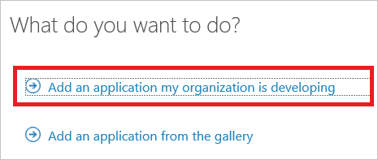
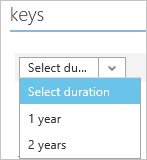
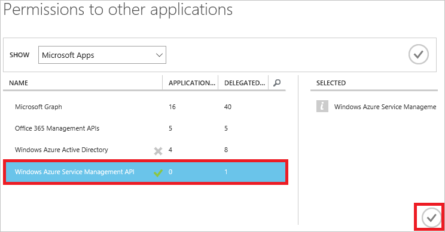
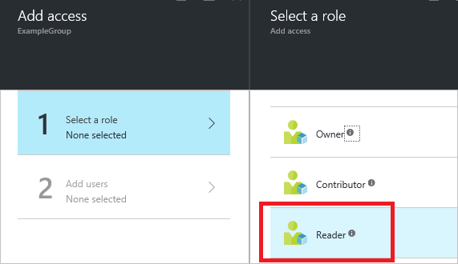
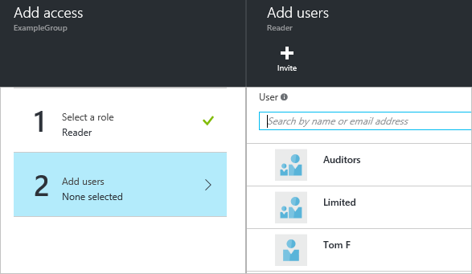
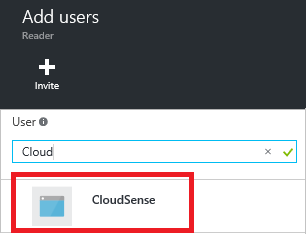
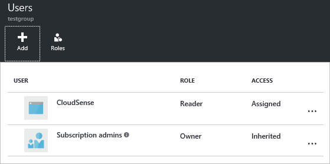

<properties
   pageTitle="在门户中创建服务主体 | Azure"
   description="介绍如何创建新的 Active Directory 应用程序和服务主体，在 Azure 资源管理器中将此服务主体与基于角色的访问控制配合使用可以管理对资源的访问权限。"
   services="azure-resource-manager"
   documentationCenter="na"
   authors="tfitzmac"
   manager="timlt"
   editor="tysonn"/>

<tags
   ms.service="azure-resource-manager"
   ms.date="07/19/2016"
   wacn.date="09/19/2016" />

# 使用门户创建可访问资源的 Active Directory 应用程序和服务主体

> [AZURE.SELECTOR]
- [PowerShell](/documentation/articles/resource-group-authenticate-service-principal/)
- [Azure CLI](/documentation/articles/resource-group-authenticate-service-principal-cli/)

当应用程序需要访问或修改资源时，必须设置 Active Directory (AD) 应用程序，并为其分配所需的权限。本主题演示如何通过门户执行这些步骤。目前，必须使用经典门户来创建一个新的 Active Directory 应用程序，然后切换到 Azure 门户，以便为该应用程序分配角色。

> [AZURE.NOTE] 通过 [PowerShell](/documentation/articles/resource-group-authenticate-service-principal/) 或 [Azure CLI](/documentation/articles/resource-group-authenticate-service-principal-cli/) 设置 AD 应用程序和服务主体可能会更方便，尤其是要使用证书进行身份验证时。本主题不会介绍如何使用证书。

有关 Active Directory 概念的说明，请参阅 [Application Objects and Service Principal Objects](/documentation/articles/active-directory-application-objects/)（应用程序对象和服务主体对象）。
有关 Active Directory 身份验证的详细信息，请参阅 [Azure AD 的身份验证方案](/documentation/articles/active-directory-authentication-scenarios/)。

有关将应用程序集成到 Azure 以管理资源的详细步骤，请参阅 [Developer's guide to authorization with the Azure Resource Manager API](/documentation/articles/resource-manager-api-authentication/)（使用 Azure Resource Manager API 进行授权的开发人员指南）。

## 创建 Active Directory 应用程序

1. 通过[Azure 经典管理门户](https://manage.windowsazure.cn/)登录到你的 Azure 帐户。

2. 在左侧窗格中选择“Active Directory”。

     
     
3. 选择要用于创建新应用程序的 Active Directory。如果有多个 Active Directory，通常需要在订阅所在目录中创建应用程序。只能为与订阅在同一目录中的应用程序授予对订阅中资源的访问权限。

     
     
    若需查找订阅的目录，请选择“设置”，然后查找目录名称。
   
     

3. 若要查看目录中的应用程序，请单击“应用程序”。

     

4. 如果你之前尚未在该目录中创建应用程序，则应该会看到与下面类似的图像。单击“添加应用程序”。

     

     或者，单击底部窗格中的“添加”。

     

5. 选择你想要创建的应用程序类型。对于本教程，请选择“添加我的组织正在开发的应用程序”。

     

6. 提供应用程序的名称，并选择要创建的应用程序的类型。对于本教程，请创建“WEB 应用程序和/或 WEB API”，然后单击“下一步”按钮。如果选择“本机客户端应用程序”，则本文的剩余步骤将与体验不符。

     

7. 填写应用程序的属性。对于“登录 URL”，请提供用于描述应用程序的网站 URI。将不验证该网站是否存在。对于“应用程序 ID URI”，请提供用于标识应用程序的 URI。

     

你已创建应用程序。

## 获取客户端 ID 和身份验证密钥

以编程方式登录时，需要应用程序的 ID。如果应用程序在其自己的凭据下运行，则还需要身份验证密钥。

1. 单击“配置”选项卡以配置应用程序的密码。

     

2. 复制**客户端 ID**。
  
     

3. 如果应用程序将在其自己的凭据下运行，请向下滚动到“密钥”部分，并选择希望密码保持有效的时间。

     

4. 选择“保存”以创建密钥。

     

     随后将显示保存的密钥，你可以复制该密钥。以后你无法检索该密钥，因此建议你复制该密钥。

     

## 获取租户 ID

如果以编程方式登录，你需要将租户 ID 与身份验证请求一起传递。对于 Web 应用和 Web API 应用，可以通过选择屏幕底部的“查看终结点”，然后检索 ID 来检索租户 ID，如下所示。

   

你还可以通过 PowerShell 来检索租户 ID：

    Get-AzureRmSubscription

也可以使用 Azure CLI：

    azure account show --json

## 设置委派权限

如果应用程序代表登录用户来访问资源，则你必须向应用程序授予访问其他应用程序的委派权限。可以在“配置”选项卡的“对其他应用程序的权限”部分中执行此操作。默认情况下，Azure Active Directory 已启用委派权限。请将此委派权限保持不变。

1. 选择“添加应用程序”。

2. 在列表中选择“Azure 服务管理 API”。然后，选择“完成”图标。

      

3. 在委派权限的下拉列表中，选择“以组织形式访问 Azure 服务管理”。

      

4. 保存更改。

## 配置多租户应用程序

如果其他 Azure Active Directory 的用户可以同意应用程序并登录，则你必须启用多租户。在“配置”选项卡中，将“应用程序属于多租户型”设置为“是”。

## 将应用程序分配到角色

如果应用程序在其自己的凭据下运行，则必须将应用程序分配到某个角色。你必须决定哪个角色表示应用程序的相应权限。若要了解有关可用角色的信息，请参阅 [RBAC：内置角色](/documentation/articles/role-based-access-built-in-roles/)。

若要分配角色，必须拥有[所有者](/documentation/articles/role-based-access-built-in-roles#owner)角色或[用户访问管理员](/documentation/articles/role-based-access-built-in-roles#user-access-administrator)角色授予的 `Microsoft.Authorization/*/Write` 访问权限。

可将作用域设置为订阅、资源组或资源级别。作用域的较低级别将继承权限（例如，将某个应用程序添加到资源组的“读取者”角色意味着该应用程序可以读取该资源组及其包含的所有资源）。

1. 若要将应用程序分配到角色，请从经典门户切换到 [Azure 门户预览](https://portal.azure.cn)。

1. 在 Azure 门户预览中，导航到你要将应用程序分配到的作用域级别。对于本主题，你可以导航到资源组，然后从资源组边栏选项卡中选择“访问”图标。

     

2. 选择“添加”。

     

3. 选择“读取者”角色（或你要将应用程序分配到的任何角色）。

     

4. 当你首次看到可添加到角色的用户列表时，将看不到应用程序，而只会看到组和用户。

     

5. 若要查找你的应用程序，必须搜索它。开始键入应用程序的名称，随后可用选项的列表会发生变化。在列表中看到你的应用程序后，请选择它。

     

6. 选择“确定”完成角色分配。现在，已分配到资源组角色的用户列表中应会出现你的应用程序。

     

有关通过门户预览将用户和应用程序分配到角色的详细信息，请参阅[使用 Azure 门户预览管理访问权限](/documentation/articles/role-based-access-control-configure/#manage-access-using-the-azure-management-portal)。

## 示例应用程序

以下示例应用程序演示如何以服务主体身份登录。

**.NET**

- [在 .NET 中使用模板部署启用 SSH 的 VM](https://azure.microsoft.com/documentation/samples/resource-manager-dotnet-template-deployment/)
- [使用 .NET 管理 Azure 资源和资源组](https://azure.microsoft.com/documentation/samples/resource-manager-dotnet-resources-and-groups/)

**Java**

- [资源入门 - 在 Java 中使用 Azure Resource Manager 模板部署资源](https://azure.microsoft.com/documentation/samples/resources-java-deploy-using-arm-template/)
- [资源入门 - 在 Java 中管理资源组](https://azure.microsoft.com/documentation/samples/resources-java-manage-resource-group//)

**Python**

- [在 Python 中使用模板部署启用 SSH 的 VM](https://azure.microsoft.com/documentation/samples/resource-manager-python-template-deployment/)
- [使用 Python 管理 Azure 资源和资源组](https://azure.microsoft.com/documentation/samples/resource-manager-python-resources-and-groups/)

**Node.js**

- [在 Node.js 中使用模板部署启用 SSH 的 VM](https://azure.microsoft.com/documentation/samples/resource-manager-node-template-deployment/)
- [使用 Node.js 管理 Azure 资源和资源组](https://azure.microsoft.com/documentation/samples/resource-manager-node-resources-and-groups/)

**Ruby**

- [在 Ruby 中使用模板部署启用 SSH 的 VM](https://azure.microsoft.com/documentation/samples/resource-manager-ruby-template-deployment/)
- [使用 Ruby 管理 Azure 资源和资源组](https://azure.microsoft.com/documentation/samples/resource-manager-ruby-resources-and-groups/)

## 后续步骤

- 若要了解如何指定安全策略，请参阅 [Azure 基于角色的访问控制](/documentation/articles/role-based-access-control-configure/)。

<!---HONumber=Mooncake_0912_2016-->