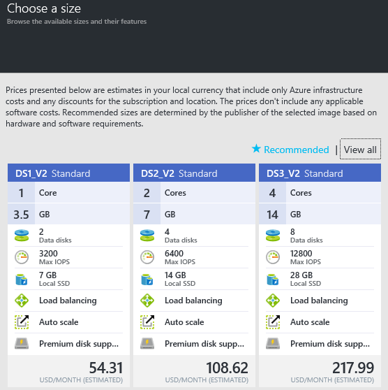

<properties
   pageTitle="排查常见的 Azure 部署错误 | Azure"
   description="说明如何解决使用 Azure Resource Manager 将资源部署到 Azure 时的常见错误。"
   services="azure-resource-manager"
   documentationCenter=""
   tags="top-support-issue"
   authors="tfitzmac"
   manager="timlt"
   editor="tysonn"
   keywords="部署错误, azure 部署, 部署到 azure"/>

<tags
   ms.service="azure-resource-manager"
   ms.date="07/14/2016"
   wacn.date="08/15/2016"/>

# 排查使用 Azure Resource Manager 时的常见 Azure 部署错误

本主题介绍如何解决可能遇到的一些常见 Azure 部署错误。如果你需要详细了解部署错误，请先参阅[查看部署操作](/documentation/articles/resource-manager-troubleshoot-deployments-portal)，然后再回到此文章来获取相关帮助以解决该错误。

## 无效的模板或资源

在部署模板时，你可能会收到：

    Code=InvalidTemplate 
    Message=Deployment template validation failed

如果收到的错误指出模板或资源的属性无效，则你的模板可能存在语法错误。此错误很容易发生，因为模板表达式可能很复杂。例如，存储帐户的以下名称分配包含一组方括号、三个函数、三组圆括号、一组单引号和一个属性：

    "name": "[concat('storage', uniqueString(resourceGroup().id))]",

如果未提供所有匹配的语法，该模板将生成一个与你的意图有很大差异的值。

当你收到此类错误时，请仔细检查表达式语法。

## 段长度不正确

当资源名称的格式不正确时，会发生另一种模板无效错误。

    Code=InvalidTemplate
    Message=Deployment template validation failed: 'The template resource {resource-name}' 
    for type {resource-type} has incorrect segment lengths.

根级别的资源其名称中的段必须比资源类型中的段少一个。段之间用斜杠隔开。在下面的示例中，类型有 2 个段，名称有 1 个段，因此为**有效名称**。

    {
      "type": "Microsoft.Web/serverfarms",
      "name": "myHostingPlanName",

但下一个示例**不是有效名称**，因为其段数与类型的段数相同。

    {
      "type": "Microsoft.Web/serverfarms",
      "name": "appPlan/myHostingPlanName",

对于子资源来说，类型和名称的段数必须相同。之所以必须这样，是因为子资源的完整名称和类型包含父名称和类型，因此完整名称的段比完整类型的段少一个。

    "resources": [
        {
            "type": "Microsoft.KeyVault/vaults",
            "name": "contosokeyvault",
            ...
            "resources": [
                {
                    "type": "secrets",
                    "name": "appPassword",

确保段数正确对于 Resource Manager 类型来说可能特别困难，这些类型应用到各个资源提供程序。例如，对网站应用资源锁需要使用包含 4 个段的类型。因此，该名称包含 3 个段：

    {
        "type": "Microsoft.Web/sites/providers/locks",
        "name": "[concat(variables('siteName'),'/Microsoft.Authorization/MySiteLock')]",

## 资源名称已由其他资源占用或使用

对某些资源，尤其是存储帐户、数据库服务器和网站，必须为其提供一个名称，这个名称在所有 Azure 中都是唯一的。如果不提供唯一名称，则会收到下面这样的错误：

    Code=StorageAccountAlreadyTaken 
    Message=The storage account named mystorage is already taken.

可将命名约定与 [uniqueString](resource-group-template-functions.md#uniquestring) 函数的结果连接起来创建一个唯一名称。

    "name": "[concat('contosostorage', uniqueString(resourceGroup().id))]",
    "type": "Microsoft.Storage/storageAccounts",

## 部署期间找不到资源

如果可能，Resource Manager 将通过并行创建资源来优化部署。如果一个资源必须在另一个资源之后部署，则需在模板中使用 **dependsOn** 元素创建与其他资源的依赖关系。例如，在部署 Web 应用时，App Service 计划必须存在。如果未指定该 Web 应用与 App Service 计划的依赖关系，Resource Manager 将同时创建这两个资源。你将收到一条错误消息，指出找不到 App Service 计划资源，因为尝试在 Web 应用上设置属性时它尚不存在。在 Web 应用中设置依赖关系可避免此错误。

    {
      "apiVersion": "2015-08-01",
      "type": "Microsoft.Web/sites",
      ...
      "dependsOn": [
        "[variables('hostingPlanName')]"
      ],
      ...
    }

## 在对象上找不到成员“copy”

当你将 **copy** 元素应用于不支持该元素的模板部分时，会遇到此错误。只能将 copy 元素应用于资源类型。不能将 copy 应用于资源类型中的属性。例如，可以将 copy 应用于虚拟机，但不能将其应用于虚拟机的 OS 磁盘。在某些情况下，可以将子资源转换为父资源，以创建复制循环。有关使用 copy 的详细信息，请参阅[在 Azure Resource Manager 中创建多个资源实例](/documentation/articles/resource-group-create-multiple/)。

## SKU 不可用

在部署资源（通常为虚拟机）时，可能会收到以下错误代码和错误消息：

    Code: SkuNotAvailable
    Message: The requested tier for resource '<resource>' is currently not available in location '<location>' for subscription '<subscriptionID>'. Please try another tier or deploy to a different location.

当所选的资源 SKU（如 VM 大小）不可用于所选的位置时，会收到此错误。有两个选项可解决此问题：

1.	登录到门户中，并通过 UI 开始添加新资源。设置值时，你将看到该资源的可用 SKU。

    

2.	如果你在该区域或满足业务需求的备用区域中找不到合适的 SKU，请与 [Azure 支持](https://portal.azure.cn/#create/Microsoft.Support)联系。

## 找不到已注册提供程序

部署资源时，你可能会收到以下错误代码和消息：

    Code: NoRegisteredProviderFound
    Message: No registered resource provider found for location '<location>' and API version '<api-version>' for type '<resource-type>'.

你会因以下三种原因之一收到此错误：

1. 资源类型不支持该位置
2. 资源类型不支持该 API 版本
3. 尚未为你的订阅注册资源提供程序

错误消息应提供有关支持的位置和 API 版本的建议。可以将模板更改为建议的值之一。Azure 门户或正在使用的命令行接口会自动注册大多数提供程序；但非全部。如果你以前未使用特定的资源提供程序，则可能需要注册该提供程序。你可以使用以下命令了解更多有关资源提供程序的信息。

### PowerShell

若要查看注册状态，请使用 **Get-AzureRmResourceProvider**。

    Get-AzureRmResourceProvider -ListAvailable

若要注册提供程序，请使用 **Register-AzureRmResourceProvider**，并提供想要注册的资源提供程序的名称。

    Register-AzureRmResourceProvider -ProviderNamespace Microsoft.Cdn

若要获取特定类型的资源支持的位置，请使用：

    ((Get-AzureRmResourceProvider -ProviderNamespace Microsoft.Web).ResourceTypes | Where-Object ResourceTypeName -eq sites).Locations

若要获取特定类型的资源支持的 API 版本，请使用：

    ((Get-AzureRmResourceProvider -ProviderNamespace Microsoft.Web).ResourceTypes | Where-Object ResourceTypeName -eq sites).ApiVersions

### Azure CLI

若要查看是否已注册提供程序，请使用 `azure provider list` 命令。

    azure provider list

若要注册资源提供程序，请使用 `azure provider register` 命令，并指定要注册的命名空间。

    azure provider register Microsoft.Cdn

若要查看资源提供程序支持的位置和 API 版本，请使用：

    azure provider show -n Microsoft.Compute --json > compute.json

## 超出配额

当部署超出配额（可能是根据资源组、订阅、帐户和其他范围指定的）时，你可能会遇到问题。例如，订阅可能配置为限制某个区域的核心数目。如果你尝试部署超过允许核心数目的虚拟机，将收到指出超过配额的错误消息。有关完整的配额信息，请参阅 [Azure 订阅和服务限制、配额与约束](/documentation/articles/azure-subscription-service-limits/)。

若要检查订阅的核心配额，可以使用 Azure CLI 中的 `azure vm list-usage` 命令。以下示例演示了核心配额为 4 的免费试用帐户：

    azure vm list-usage

将返回：

    info:    Executing command vm list-usage
    Location: chinaeast
    data:    Name   Unit   CurrentValue  Limit
    data:    -----  -----  ------------  -----
    data:    Cores  Count  0             4
    info:    vm list-usage command OK

如果你打算尝试部署一个模板，该模板在中国东部地区的上述订阅中创建多于 4 个的核心，则你会遇到与以下错误类似的部署错误（在门户中或通过调查部署日志）：

    statusCode:Conflict
    serviceRequestId:xxxxxxxx-xxxx-xxxx-xxxx-xxxxxxxxxxxx
    statusMessage:{"error":{"code":"OperationNotAllowed","message":"Operation results in exceeding quota limits of Core. Maximum allowed: 4, Current in use: 4, Additional requested: 2."}}

或者，如果在 PowerShell 中，则可使用 **Get-AzureRmVMUsage** cmdlet。

    Get-AzureRmVMUsage

将返回：

    ...
    CurrentValue : 0
    Limit        : 4
    Name         : {
                     "value": "cores",
                     "localizedValue": "Total Regional Cores"
                   }
    Unit         : null
    ...

在这种情况中，你应前往门户并提交一份支持问题以增加你在要部署区域内的配额。

> [AZURE.NOTE] 请记住，对于资源组，配额针对每个单独的区域，而不是针对整个订阅。如果你需要在中国东部部署 30 个核心，则必须在中国东部寻求 30 个资源管理器核心。如果你需要在你有权访问的任何区域内部署总共 30 个核心，则应在所有区域内寻求总共 30 个核心。

## 授权失败

你可能在部署期间收到错误，因为尝试部署资源的帐户或服务主体没有执行这些操作的访问权限。Azure Active Directory 可让你或你的系统管理员非常精确地控制哪些标识可以访问哪些资源。例如，如果帐户分配有“读取者”角色，它将无法创建新资源。在此情况下，你应会看到错误消息，指出授权失败。

有关基于角色的访问控制的详细信息，请参阅 [Azure 基于角色的访问控制](/documentation/articles/role-based-access-control-configure/)。

除了基于角色的访问控制以外，部署操作可能还受限于订阅的策略。通过策略，管理员可以对订阅中所有资源部署强制实施约定。例如，管理员可以要求为某个资源类型提供特定的标记值。如果不满足策略要求，你将在部署期间收到错误。有关策略的详细信息，请参阅 [使用策略来管理资源和控制访问](/documentation/articles/resource-manager-policy/)。

## 虚拟机故障排除

| 错误 | 文章 |
| -------- | ----------- |
| 自定义脚本扩展错误 | [Windows VM 扩展失败](/documentation/articles/virtual-machines-windows-extensions-troubleshoot/) 或  [Linux VM 扩展失败](/documentation/articles/virtual-machines-linux-extensions-troubleshoot/) | 
| OS 映像预配错误 | [新 Windows VM 错误](/documentation/articles/virtual-machines-windows-troubleshoot-deployment-new-vm/) 或 [新 Linux VM 错误](/documentation/articles/virtual-machines-linux-troubleshoot-deployment-new-vm/) | 
| 分配失败 | [Windows VM 分配失败](/documentation/articles/virtual-machines-windows-allocation-failure/) 或  [Linux VM 分配失败](/documentation/articles/virtual-machines-linux-allocation-failure/) | 
| 尝试进行连接时的安全外壳 (SSH) 错误 | [到 Linux VM 的安全外壳连接](/documentation/articles/virtual-machines-linux-troubleshoot-ssh-connection/) | 
| 连接到 VM 上运行的应用程序时出错 | [Windows VM 上运行的应用程序](/documentation/articles/virtual-machines-windows-troubleshoot-app-connection/) 或  [Linux VM 上运行的应用程序](/documentation/articles/virtual-machines-linux-troubleshoot-app-connection/) | 
| 远程桌面连接错误 | [到 Windows VM 的远程桌面连接](/documentation/articles/virtual-machines-windows-troubleshoot-rdp-connection/) | 
| 通过重新部署已解决的连接错误 | [将虚拟机重新部署到新的 Azure 节点](/documentation/articles/virtual-machines-windows-redeploy-to-new-node/) | 
| 云服务错误 | [云服务部署问题](/documentation/articles/cloud-services-troubleshoot-deployment-problems/) | 

## 其他服务故障排除

下表不是 Azure 的故障排除主题的完整列表。而是，它重点介绍与部署或配置资源相关的问题。如果你需要帮助排查资源的运行时问题，请参阅该 Azure 服务的文档。

| 服务 | 文章 |
| -------- | -------- |
| 自动化 | [Azure 自动化中常见错误的疑难解答提示](/documentation/articles/automation-troubleshooting-automation-errors/) | 
| Service Fabric | [排查在 Azure Service Fabric 上部署服务时遇到的常见问题](/documentation/articles/service-fabric-diagnostics-troubleshoot-common-scenarios/) | 
| 站点恢复 | [监视虚拟机和物理服务器的保护及其故障排除](/documentation/articles/site-recovery-monitoring-and-troubleshooting/) |
| 存储 | [监视、诊断和排查 Azure 存储空间问题](/documentation/articles/storage-monitoring-diagnosing-troubleshooting/) |
| SQL 数据库 | [排查 Azure SQL 数据库的连接问题](/documentation/articles/sql-database-troubleshoot-common-connection-issues/) | 
| SQL 数据仓库 | [排查 Azure SQL 数据仓库问题](/documentation/articles/sql-data-warehouse-troubleshoot/) | 

## 了解部署何时准备就绪

Azure Resource Manager 部署成功返回所有提供程序时，将报告部署成功。但是，这不一定表示你的资源组“处于活动状态且可供用户使用”。例如，部署可能需要下载升级文件、等待其他非模板资源，或者安装复杂的脚本或 Azure 不知道的其他某个可执行活动（因为它不是提供程序正在跟踪的活动）。在这些情况下，可能要在一段时间后，你的资源才可供实际使用。因此，你应该预料到部署状态成功一段时间后，才能使用部署。

不过，创建自定义模板的自定义脚本（例如，使用 [CustomScriptExtension](https://azure.microsoft.com/blog/2014/08/20/automate-linux-vm-customization-tasks-using-customscript-extension/)），即可防止 Azure 报告部署成功，而此自定义脚本知道如何监视整个部署以了解系统是否准备就绪，并只在用户可以与整个部署交互时才会成功返回。如果你想要确保最后才运行你的扩展，请在模板中使用 **dependsOn** 属性。

## 后续步骤

- 若要了解审核操作，请参阅 [使用 Resource Manager 执行审核操作](/documentation/articles/resource-group-audit/)。
- 若要了解部署期间为确定错误需要执行哪些操作，请参阅[查看部署操作](/documentation/articles/resource-manager-troubleshoot-deployments-portal)。

<!---HONumber=Mooncake_0808_2016-->