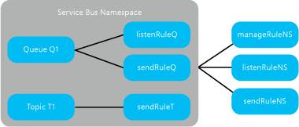

<properties 
   pageTitle="服务总线的共享访问签名身份验证 | Microsoft Azure"
   description="关于服务总线的 SAS 身份验证的详细信息。"
   services="service-bus"
   documentationCenter="na"
   authors="sethmanheim"
   manager="timlt"
   editor="" />
<tags 
   ms.service="service-bus"
   ms.date="03/09/2016"
   wacn.date="01/14/2016" />

# 服务总线的共享访问签名身份验证

通过[共享访问签名 (SAS)](/documentation/articles/service-bus-sas-overview/) 身份验证，应用程序能够使用在命名空间或在关联了特定权限的消息传送实体（队列或主题）上配置的访问密钥向服务总线进行身份验证。然后可以使用此密钥生成 SAS 令牌，客户端反过来可用它向服务总线进行身份验证。

Azure SDK 2.0 版和更高版本包括 SAS 身份验证支持。有关服务总线身份验证的详细信息，请参阅[服务总线身份验证和授权](/documentation/articles/service-bus-authentication-and-authorization/)。

## 概念

服务总线中的 SAS 身份验证涉及配置具有服务总线资源相关权限的加密密钥。客户端通过提供 SAS 令牌，声明访问服务总线资源。此令牌包括正在访问的 URI 资源，以及一个由配置密钥签名的到期时间。

你可以在服务总线[中继](/documentation/articles/service-bus-fundamentals-hybrid-solutions/#relays)、[队列](/documentation/articles/service-bus-fundamentals-hybrid-solutions/#queues)、[主题](/documentation/articles/service-bus-fundamentals-hybrid-solutions/#topics)和[事件中心](/documentation/services/event-hubs/)上配置共享访问签名授权规则。

SAS 身份验证使用以下元素：

- [共享访问授权规则](https://msdn.microsoft.com/zh-cn/library/azure/microsoft.servicebus.messaging.sharedaccessauthorizationrule.aspx)：采用 Base64 表示的 256 位主加密密钥、一个可选的配用密钥，以及密钥名称和关联的权限（*侦听*、*发送*、*管理*权限的集合）。

- [共享访问签名](https://msdn.microsoft.com/zh-cn/library/azure/microsoft.servicebus.sharedaccesssignaturetokenprovider.sharedaccesssignature.aspx)令牌：使用 HMAC-SHA256 资源字符串生成的，包括访问的资源 URI 和一个具有加密密钥的过期时间。该签名和以下各节所述的其他元素已被格式化为字符串，用于形成 [SharedAccessSignature](https://msdn.microsoft.com/zh-cn/library/azure/microsoft.servicebus.sharedaccesssignaturetokenprovider.sharedaccesssignature.aspx) 令牌。

## 共享访问签名身份验证的配置

你可以在服务总线命名空间、队列，或主题上配置 [SharedAccessAuthorizationRule](https://msdn.microsoft.com/zh-cn/library/azure/microsoft.servicebus.messaging.sharedaccessauthorizationrule.aspx) 规则。当前不支持在服务总线订阅上配置 [SharedAccessAuthorizationRule](https://msdn.microsoft.com/zh-cn/library/azure/microsoft.servicebus.messaging.sharedaccessauthorizationrule.aspx)，但是你可以使用命名空间或主题上配置的规则来确保安全访问订阅。有关演示此步骤的工作示例，请参阅[使用服务总线订阅的共享访问签名 (SAS) 身份验证](http://code.msdn.microsoft.com/windowsazure/Using-Shared-Access-e605b37c)示例。

服务总线命名空间、队列或主题上可以配置最多 12 条这样的授权规则。在服务总线命名空间上配置的规则适用于该命名空间中的所有实体。



在此图中，*manageRuleNS*、*sendRuleNS*，以及 *listenRuleNS* 授权规则适用于队列 Q1 和主题 T1，而 *listenRuleQ*、*sendRuleQ* 仅适用于队列 Q1，*sendRuleT* 仅适用于主题 T1。

[SharedAccessAuthorizationRule](https://msdn.microsoft.com/zh-cn/library/azure/microsoft.servicebus.messaging.sharedaccessauthorizationrule.aspx) 的密钥参数如下：

|参数|说明|
|---|---|
|*KeyName*|描述授权规则的字符串。|
|*PrimaryKey*|用于签名和验证 SAS 令牌的 Base64 编码的 256 位主密钥。|
|*SecondaryKey*|用于签名和验证 SAS 令牌的 Base64 编码的 256 位备用密钥。|
|*AccessRights*|授权规则授予的访问权限列表。这些权限可以是侦听、发送和管理权限的任何集合。|

如果预配了服务总线命名空间，默认情况下，将创建 [SharedAccessAuthorizationRule](https://msdn.microsoft.com/zh-cn/library/azure/microsoft.servicebus.messaging.sharedaccessauthorizationrule.aspx)，其中，[KeyName](https://msdn.microsoft.com/zh-cn/library/azure/microsoft.servicebus.messaging.sharedaccessauthorizationrule.keyname.aspx) 设置为 **RootManageSharedAccessKey**。两个默认 [SharedAccessAuthorizationRule](https://msdn.microsoft.com/zh-cn/library/azure/microsoft.servicebus.messaging.sharedaccessauthorizationrule.aspx) 对象同样被配置为通知中心：一个具有侦听、发送和管理权限，另一个只具有侦听权限。

## 重新生成和吊销共享访问授权规则的密钥。

建议你定期重新生成 [SharedAccessAuthorizationRule](https://msdn.microsoft.com/zh-cn/library/azure/microsoft.servicebus.messaging.sharedaccessauthorizationrule.aspx) 对象中使用的密钥。应用程序通常应使用 [PrimaryKey](https://msdn.microsoft.com/zh-cn/library/azure/microsoft.servicebus.messaging.sharedaccessauthorizationrule.primarykey.aspx) 来生成 SAS 令牌。在重新生成密钥时，应使用旧主密钥替换 [SecondaryKey](https://msdn.microsoft.com/zh-cn/library/azure/microsoft.servicebus.messaging.sharedaccessauthorizationrule.secondarykey.aspx)，并生成新密钥作为新主密钥。这让你可以继续使用通过旧的主密钥颁发的尚未过期的授权令牌。

如果密钥已泄漏，并且必须吊销这些密钥，你可以同时生成 [SharedAccessAuthorizationRule](https://msdn.microsoft.com/zh-cn/library/azure/microsoft.servicebus.messaging.sharedaccessauthorizationrule.aspx) 的 [PrimaryKey](https://msdn.microsoft.com/zh-cn/library/azure/microsoft.servicebus.messaging.sharedaccessauthorizationrule.primarykey.aspx) 和 [SecondaryKey](https://msdn.microsoft.com/zh-cn/library/azure/microsoft.servicebus.messaging.sharedaccessauthorizationrule.secondarykey.aspx)，并用新的密钥替换它们。此过程将使得由旧密钥签名的所有令牌失效。

## 生成共享访问签名令牌

任何有权访问共享访问授权规则中指定的签名密钥的客户端均可以生成 SAS 令牌。格式如下：

```
SharedAccessSignature sig=<signature-string>&se=<expiry>&skn=<keyName>&sr=<URL-encoded-resourceURI>
```

SAS 令牌的**签名**使用签名字符串的 HMAC-SHA256 哈希来计算，此字符串包含授权规则的 [PrimaryKey](https://msdn.microsoft.com/zh-cn/library/azure/microsoft.servicebus.messaging.sharedaccessauthorizationrule.primarykey.aspx) 属性。签名字符串由资源 URI 和到期时间组成，格式如下：

```
StringToSign = <resourceURI> + "\n" + expiry;
```

请注意，对此操作应使用编码的资源 URI。资源 URI 是向其声明访问权限的服务总线资源的完整 URI。例如，`http://<namespace>.servicebus.chinacloudapi.cn/<entityPath>` 或 `sb://<namespace>.servicebus.chinacloudapi.cn/<entityPath>`；即，`http://contoso.servicebus.chinacloudapi.cn/contosoTopics/T1/Subscriptions/S3`。

到期时间表示为自 1970 年 1 月 1 日 00:00:00 UTC 时期以后的秒数。

用于签名的共享访问授权规则必须在此 URI 指定的实体上，或由其分层父级之一进行配置。例如，前面的示例中的 `http://contoso.servicebus.chinacloudapi.cn/contosoTopics/T1` 或 `http://contoso.servicebus.chinacloudapi.cn`。

SAS 令牌对于签名字符串中使用的 `<resourceURI>` 下的所有资源均有效。

SAS 令牌中的 [KeyName](https://msdn.microsoft.com/zh-cn/library/azure/microsoft.servicebus.messaging.sharedaccessauthorizationrule.keyname.aspx) 是指用于生成令牌的共享访问授权规则的 **keyName**。

*URL-encoded-resourceURI* 必须与在签名计算期间签名字符串中使用的 URI 相同。它应该是[百分比编码](https://msdn.microsoft.com/zh-cn/library/4fkewx0t.aspx)。

## 如何使用服务总线的共享访问签名身份验证

以下方案包括配置授权规则、生成 SAS 令牌和客户端授权。

有关演示使配置和使用 SAS 授权的服务总线应用程序的完整工作示例，请参阅[服务总线的共享访问签名身份验证](http://code.msdn.microsoft.com/Shared-Access-Signature-0a88adf8)。有关演示使用在命名空间或主题中配置的 SAS 授权规则，以保护服务总线订阅的相关示例，请参阅[使用服务总线订阅的共享访问签名 (SAS) 身份验证](http://code.msdn.microsoft.com/Using-Shared-Access-e605b37c)。

## 访问命名空间上的共享访问授权规则

在服务总线命名空间根路径上的操作需要证书身份验证。你必须上载用于 Azure 订阅的管理证书若要上载管理证书，请在 [Azure 经典管理门户][] 的左窗格中单击“设置”。有关 Azure 管理证书的详细信息，请参阅[为 Azure 创建管理证书](https://msdn.microsoft.com/zh-cn/library/azure/gg551722.aspx)。

访问服务总线命名空间上的共享访问授权规则的终结点如下所示：

```
https://management.core.chinacloudapi.cn/{subscriptionId}/services/ServiceBus/namespaces/{namespace}/AuthorizationRules/
```

若要在服务总线命名空间上创建 [SharedAccessAuthorizationRule](https://msdn.microsoft.com/zh-cn/library/azure/microsoft.servicebus.messaging.sharedaccessauthorizationrule.aspx) 对象，在此终结点上使用序列化为 JSON 或 XML 的规则信息执行 POST 操作。例如：

```
// Base address for accessing authorization rules on a namespace
string baseAddress = @"https://management.core.chinacloudapi.cn/<subscriptionId>/services/ServiceBus/namespaces/<namespace>/AuthorizationRules/";

// Configure authorization rule with base64-encoded 256-bit key and Send rights
var sendRule = new SharedAccessAuthorizationRule("contosoSendAll",
    SharedAccessAuthorizationRule.GenerateRandomKey(),
    new[] { AccessRights.Send });

// Operations on the Service Bus namespace root require certificate authentication.
WebRequestHandler handler = new WebRequestHandler
{
    ClientCertificateOptions = ClientCertificateOption.Manual
};
// Access the management certificate by subject name
handler.ClientCertificates.Add(GetCertificate(<certificateSN>));

HttpClient httpClient = new HttpClient(handler)
{
    BaseAddress = new Uri(baseAddress)
};
httpClient.DefaultRequestHeaders.Accept.Add(
    new MediaTypeWithQualityHeaderValue("application/json"));
httpClient.DefaultRequestHeaders.Add("x-ms-version", "2015-01-01");

// Execute a POST operation on the baseAddress above to create an auth rule
var postResult = httpClient.PostAsJsonAsync("", sendRule).Result;
```

与之类似，使用终结点上的 GET 操作来读取在命名空间上配置的授权规则。

若要更新或删除特定的授权规则，请使用以下终结点：

```
https://management.core.chinacloudapi.cn/{subscriptionId}/services/ServiceBus/namespaces/{namespace}/AuthorizationRules/{KeyName}
```

## 访问实体上的共享访问授权规则

你可以通过在相应 [QueueDescription](https://msdn.microsoft.com/zh-cn/library/azure/microsoft.servicebus.messaging.queuedescription.aspx)、[TopicDescription](https://msdn.microsoft.com/zh-cn/library/azure/microsoft.servicebus.messaging.topicdescription.aspx) 或 [NotificationHubDescription](https://msdn.microsoft.com/zh-cn/library/azure/microsoft.servicebus.notifications.notificationhubdescription.aspx) 对象上的 [AuthorizationRules](https://msdn.microsoft.com/zh-cn/library/azure/microsoft.servicebus.messaging.authorizationrules.aspx) 集合，访问在服务总线队列或主题中配置的 [Microsoft.ServiceBus.Messaging.SharedAccessAuthorizationRule](https://msdn.microsoft.com/zh-cn/library/azure/microsoft.servicebus.messaging.sharedaccessauthorizationrule.aspx) 对象。

下面的代码演示了如何向队列添加授权规则。

```
// Create an instance of NamespaceManager for the operation
NamespaceManager nsm = NamespaceManager.CreateFromConnectionString( 
    <connectionString> );
QueueDescription qd = new QueueDescription( <qPath> );

// Create a rule with send rights with keyName as "contosoQSendKey"
// and add it to the queue description.
qd.Authorization.Add(new SharedAccessAuthorizationRule("contosoSendKey", 
    SharedAccessAuthorizationRule.GenerateRandomKey(), 
    new[] { AccessRights.Send }));

// Create a rule with listen rights with keyName as "contosoQListenKey"
// and add it to the queue description.
qd.Authorization.Add(new SharedAccessAuthorizationRule("contosoQListenKey",
    SharedAccessAuthorizationRule.GenerateRandomKey(),
    new[] { AccessRights.Listen }));

// Create a rule with manage rights with keyName as "contosoQManageKey"
// and add it to the queue description.
// A rule with manage rights must also have send and receive rights.
qd.Authorization.Add(new SharedAccessAuthorizationRule("contosoQManageKey",
    SharedAccessAuthorizationRule.GenerateRandomKey(),
    new[] {AccessRights.Manage, AccessRights.Listen, AccessRights.Send }));

// Create the queue.
nsm.CreateQueue(qd);
```

## 使用共享访问签名授权

使用具有服务总线 .NET 库的 Azure.NET SDK 的应用程序可以通过 [SharedAccessSignatureTokenProvider](https://msdn.microsoft.com/zh-cn/library/azure/microsoft.servicebus.sharedaccesssignaturetokenprovider.aspx) 类使用 SAS 授权。下面的代码演示了使用令牌提供程序向服务总线队列发送消息。

```
Uri runtimeUri = ServiceBusEnvironment.CreateServiceUri("sb", 
    <yourServiceNamespace>, string.Empty);
MessagingFactory mf = MessagingFactory.Create(runtimeUri, 
    TokenProvider.CreateSharedAccessSignatureTokenProvider(keyName, key));
QueueClient sendClient = mf.CreateQueueClient(qPath);

//Sending hello message to queue.
BrokeredMessage helloMessage = new BrokeredMessage("Hello, Service Bus!");
helloMessage.MessageId = "SAS-Sample-Message";
sendClient.Send(helloMessage);
```

应用程序还可以通过使用可接受连接字符串的方法中的 SAS 连接字符串来使用 SAS 进行身份验证。

请注意，若要使用服务总线中继的 SAS 授权，你可以使用服务总线命名空间上配置的 SAS 密钥。如果在命名空间上显式创建中继（[NamespaceManager](https://msdn.microsoft.com/zh-cn/library/azure/microsoft.servicebus.namespacemanager.aspx) 与 [RelayDescription](https://msdn.microsoft.com/zh-cn/library/azure/microsoft.servicebus.messaging.relaydescription.aspx)）对象，你可以只为该中继设置 SAS 规则。若要使用服务总线订阅的 SAS 授权，你可以使用服务总线命名空间或主题上配置的 SAS 密钥。

## 服务总线操作所需的权限

下表显示对服务总线资源进行各种操作所需的访问权限。

|操作|所需声明|声明范围|
|---|---|---|
|**命名空间**|||
|在命名空间上配置授权规则|管理|任何命名空间地址|
|**服务注册表**|||
|枚举私有策略|管理|任何命名空间地址|
|中继|||
|开始在命名空间上侦听|侦听|任何命名空间地址|
|将消息发送到命名空间中的侦听器|发送|任何命名空间地址|
|**队列**|||
|创建队列|管理|任何命名空间地址|
|删除队列|管理|任何有效队列地址|
|枚举队列|管理|/$Resources/Queues|
|获取队列说明|管理或发送|任何有效队列地址|
|在队列上配置授权规则|管理|任何有效队列地址|
|发送到队列|发送|任何有效队列地址|
|从队列接收消息|侦听|任何有效队列地址|
|在查看锁定模式下接收消息后放弃或完成消息|侦听|任何有效队列地址|
|推迟消息以供将来检索|侦听|任何有效队列地址|
|将消息放入死信队列|侦听|任何有效队列地址|
|获取与消息队列会话关联的状态|侦听|任何有效队列地址|
|设置与消息队列会话关联的状态|侦听|任何有效队列地址|
|**主题**|||
|创建主题|管理|任何命名空间地址|
|删除主题|管理|任何有效主题地址|
|枚举主题|管理|/$Resources/Topics|
|获取主题描述|管理或发送|任何有效主题地址|
|在主题上配置授权规则|管理|任何有效主题地址|
|发送到主题|发送|任何有效主题地址|
|**订阅**|||
|创建订阅|管理|任何命名空间地址|
|删除订阅|管理|../myTopic/Subscriptions/mySubscription|
|枚举订阅|管理|../myTopic/Subscriptions|
|获取订阅说明|管理或侦听|../myTopic/Subscriptions/mySubscription|
|在查看锁定模式下接收消息后放弃或完成消息|侦听|../myTopic/Subscriptions/mySubscription|
|推迟消息以供将来检索|侦听|../myTopic/Subscriptions/mySubscription|
|将消息放入死信队列|侦听|../myTopic/Subscriptions/mySubscription|
|获取与主题会话关联的状态|侦听|../myTopic/Subscriptions/mySubscription|
|设置与主题会话关联的状态|侦听|../myTopic/Subscriptions/mySubscription|
|**规则**|||
|创建规则|管理|../myTopic/Subscriptions/mySubscription|
|删除规则|管理|../myTopic/Subscriptions/mySubscription|
|枚举规则|管理或侦听|../myTopic/Subscriptions/mySubscription/Rules|
|**通知中心**|||
|创建通知中心|管理|任何命名空间地址|
|为活动设备创建或更新注册|侦听或管理|../notificationHub/tags/{tag}/registrations|
|更新 PNS 信息|侦听或管理|../notificationHub/tags/{tag}/registrations/updatepnshandle|
|发送到通知中心|发送|../notificationHub/messages|

## 后续步骤

有关服务总线中的 SAS 的高级概述，请参阅[共享访问签名](/documentation/articles/service-bus-sas-overview/)。

有关服务总线身份验证的更多背景信息，请参阅[服务总线身份验证和授权](/documentation/articles/service-bus-authentication-and-authorization/)。
[Azure 经典管理门户]: http://manage.windowsazure.cn

<!---HONumber=Mooncake_0104_2016-->