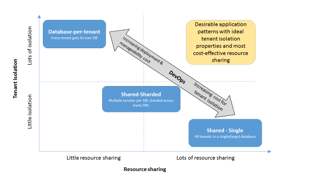

<properties
   pageTitle="包含 Azure SQL 数据库的多租户 SaaS 应用程序的设计模式 | Azure" 
   description="本文介绍云环境中运行的多租户数据库应用程序需要考虑的要求和通用数据体系结构模式，以及与这些模式相关的各种利弊。此外，还说明了 Azure SQL 数据库服务及其弹性数据库池和弹性工具如何在不造成损害的情况下满足这些要求。"
   keywords=""
   services="sql-database"
   documentationCenter=""
   authors="carlrabeler"
   manager="jhubbard"
   editor=""/>

<tags
   ms.service="sql-database"
   ms.date="06/07/2016"
   wacn.date="07/11/2016"/>

# 包含 Azure SQL 数据库的多租户 SaaS 应用程序的设计模式

在本文中，你将了解云环境中运行的多租户软件即服务 (SaaS) 数据库应用程序需要考虑的要求和通用数据体系结构模式，以及与这些模式相关的各种利弊。此外，还说明了 Azure SQL 数据库服务及其弹性数据库池和弹性工具如何在不造成损害的情况下满足这些要求。

## 介绍

从最近几年来与 SaaS 应用程序提供商的合作中，我们发现，开发人员在设计多租户应用程序数据层的租用模型时，所做的选择经常违背最大长远利益。至少在一开始，他们认为轻松开发和较低的云提供程序成本比应用程序的租户隔离或可缩放性更重要。这通常会在日后导致客户满意度出现问题，并且为了纠正方向而付出代价。

在本文中，多租户应用程序是指云环境中托管的应用程序，它向不共享或看不到彼此数据的多个（数百或数千个）租户提供一组相同的服务。SaaS 应用程序就是这种服务的典型例子，能够向云托管环境中的租户提供服务。

## 多租户应用程序

在可轻松分区数据和工作负荷的应用程序类型中，多租户应用程序算是很明显的例子。例如，在多租户应用程序中，数据和工作负荷通常可以沿着租户边界分区，因为大多数请求都在租户的边界内。这是数据和工作负荷与生俱来的属性，支持本文的整个余下部分将要介绍的应用程序模式。

在整个云式应用程序范畴内，此类应用程序随处可见，包括
- 转换成云即 SaaS 应用程序的 ISV 数据库应用程序
- 从无到有针对云构建的 SaaS 应用程序
- 直接面向消费者/用户的应用程序 
- 面向员工的企业应用程序

从云生成的 SaaS 应用程序和根植于 ISV 数据库应用程序的 SaaS 应用程序，通常会演变成多租户应用程序。这些 SaaS 应用程序提供专用的软件应用程序即服务给其租户。租户可以访问应用程序服务，对于随应用程序一起存储的关联数据有完全的所有权。但是，为了享受 SaaS 的优点，租户在其本身的数据上必须让出一定程度的控制权，信任 SaaS 供应商妥善保管数据，并与其他租户的数据隔离。常见的例子包括 MyOB、SnelStart、Salesforce 等。所有这些应用程序都允许沿着租户边界来分区，因此，支持本文以下部分介绍的应用程序模式。

提供直接服务给消费者或组织内员工（通常称为用户，而不是租户）的应用程序，在多租户应用程序范畴内形成另一种类别。客户只订阅服务，并不拥有服务提供程序所收集和存储的数据。除非基于政府强制规定的隐私法规，服务提供程序不严格请求隔离客户彼此的数据。典型的例子是媒体内容提供程序，例如 Netflix、Spotify、Xbox-live 等。还有其他可轻松分区的应用程序例子，包括面向客户的 Internet 级应用程序，或物联网 (IoT) 应用程序，其中，每个客户或设备都可能成为分区，在不同的用户或设备之间就可以划出分区边界。

但是，我们也了解并非所有应用程序都可轻松地沿着单个属性来分区，例如租户、客户、用户或设备。例如，以涉及产品、订单、客户的复杂 ERP（企业资源计划）应用程序为例子。它们通常使用复杂的架构，具有数千个紧密相互链接的表。单个分区策略不可能适用于所有表和运用于整个工作负荷。因此，在本文其余的整个介绍中，我们将明确排除这种应用程序。

在以下部分中，我们探讨的多租户设计模式适用于上述所有应用程序模式，它们具有可轻松分区的数据和工作负荷。但是，为了简化演示，我们直接以多租户 SaaS 应用程序来代表它们全体。

## 多租户应用程序设计的利弊

对于在云中构建多租户应用程序的开发人员，有以下总体考虑因素：

-	**租户隔离**：开发人员必须确保租户不可能越权访问其他租户的数据。此隔离要求扩展为其他属性，例如避开干扰性邻居、能够还原给定租户的数据、租户特定的自定义等。 
-	**云资源成本**：SaaS 应用程序需要具有成本竞争力。有鉴于此，SaaS 应用程序的开发人员在设计多租户应用程序时，将力求降低云资源使用量的成本（计算、存储等）。
-	**简化 DevOps**：多租户应用程序提供程序需要构建隔离保护、维护其应用程序、数据库架构、监视其运行状况，以及对租户的问题进行故障排除。应用程序开发和操作的复杂性直接导致成本增加和租户满意度降低。
-	**可缩放性**：逐渐增加更多租户，同时为需要更多资源的个别租户增加更多容量是 SaaS 操作成功的不二法门。

这些方面有其利弊取舍。成本最低的云产品不见得提供最方便的开发体验。在上述四方面交织而成的问题上，经常看到开发人员做出不明智的选择。

对于供应给其他企业的 SaaS 多租户应用程序，租户隔离经常是基本要求。常见开发人员在简单性和成本考虑方面短视近利，而不重视隔离和可缩放性。随着服务不断发展，以及租户隔离要求变得更加重要，此取舍使情况更趋于复杂且代价昂贵，需要在应用程序层次解决。

对于提供直接面向使用者的服务给用户的多租户应用程序，很可能为了让云资源成本发挥最高效益，而较不重视租户隔离。

常见的开发模式是将多个租户打包到一个或多个数据库中。这种方法的（表面上）好处是成本较低，只需付出少数几个数据库的成本，并尽可能只处理越少的数据库，让事情变得更简单。对于 SaaS 多租户应用程序，经过一段时间，这种确定在租户隔离和可缩放性方面开始暴露重大的缺点。如果需要租户隔离，将需要投入更多心力，以防止未经授权访问或干扰性邻居干扰共享存储中的租户数据，因而造成应用程序开发任务和隔离维护成本暴增。同样地，当添加新的租户时，为了适当缩放此类应用程序的数据层，通常需要凭借开发专长，将租户数据重新分布于数据库之间。

## 多租户数据模型 

放置租户数据的常见设计实践都遵循这三种不同的模型。

   
    图 1：多租户数据模型的常见设计实践
  
1.	**租户各有数据库**：这种方法将每个租户放在它自己的数据库中。租户特定的所有数据局限在其数据库内，与其他租户及其数据隔离。
2.	**分片的共享数据库**：这种方法使用多个数据库，由多个租户共享一个数据库，也就是运用分区策略（例如哈希、范围或列表分区），将一组不同的租户分配到每个数据库。这种数据分布策略通常称为分片。
3.	**单个共享数据库**：这种方法使用单个数据库（有时很大），其中包含以租户 ID 来区分的所有租户的数据。 
  
> [AZURE.NOTE] 有时，不同的租户也放在不同的数据库架构中，并以架构名称来区分不同的租户。这种方法通常需要使用动态 SQL，也无法有效使用计划缓存，不建议采用。因此，本文的其余部分着重于此类别中的共享表方法。
 
## 常见多租户数据模型的特征

评估使用这些多租户数据模型时，必须根据我们在上一部分介绍的应用程序设计取舍来做确定。

-	**隔离**：以租户之间的隔离程度衡量数据模型可实现的租户隔离效果，以及
-	**云资源成本**：为了让云资源成本发挥最高效益而在租户之间发生的资源共享规模。资源可定义为计算和存储成本。 
-	**DevOps 成本**：简化应用程序开发、部署和管理性可降低整体 SaaS 操作成本。  

使用这些维度，我们可以通过象限空间描绘前面所述的多租户数据模型及其数据库使用量，如下图 2 所示。租户隔离程度和资源共享规模描述空间的 Y 和 X 轴维度。中间的对角线大箭头表示 DevOps 成本。

 
    图 2：常见多租户数据模型的特征

上图 2 右下面的象限显示使用可能很大的单个共享数据库，并配合共享表（或另一个架构），作为其中一个应用程序模式。因为所有租户都使用单一数据库上相同的数据库资源（CPU、内存和 IO...），资源共享程度很高。但是，租户隔离有限。需要采取额外的措施，在应用程序级别上隔离租户彼此，这在应用程序开发和管理方面可能大幅增加 DevOps 成本。此外，可缩放性受限于用于托管数据库的硬件规模。

中间部分演示在多个不同数据库之间分片的多个租户（通常是不同的硬件缩放单位），每个数据库托管一部分租户，这就解决了前一个模式的可缩放性问题。如果需要新的容量来应对更多租户，只需将租户放在分配给新硬件缩放单位的新数据库即可，很简单。但是，资源共享规模缩小，因为只有放在相同缩放单位的租户才共享资源。此外，这种方法也无助于改善租户隔离，因为仍有许多租户共置于相同的位置，自然无法免于彼此操作的干扰。应用程序复杂性仍然很高。这种方法通常称为“分片”。

上图 2 左上方的象限是第三种方法。它将每个租户放在自己的数据库中。这种方法的租户隔离特性很显著，但是当每个数据库提供它自己专用的资源时，资源共享效益就很低。如果所有租户都展现可预测的工作负荷，这是个好方法。但是，后租户工作负荷变得较难预测（常见于 SaaS），资源共享就无法优化，导致提供程序为了满足需求而过度预配，或因为资源减少而导致成本增加或租户满意度降低。因此，租户之间的资源共享程度越高，才能使解决方案越符合成本效益。增加数据库数目也在应用程序部署和维护方面增加 DevOps 成本。在下一部分，我们将回头介绍这些问题，但务必记住，相比于其他方法，此方法为租户提供最佳又最简单的隔离。

以下因素也会影响客户选择设计模式：

-	**租户数据的所有权**：如果租户保留数据的所有权，应该选择个别租户单一数据库模式
-	**规模**：如果应用程序以数十万或数百万个租户为目标，应该选择数据库共享方法，例如分片，但仍可能要解决隔离要求。
-	**价值和业务模型**：如果每个租户的营收很少（少于一美元），隔离要求就变得较不重要，而共享数据库会比较有利。如果有几美元或更多，则为每个租户配置数据库就变得较为可行，也能降低应用程序开发运营成本。

根据上图 2 所示的取舍，理想的多租户模型必须兼顾卓越的租户隔离属性，让租户之间资源共享达到优化，也就是符合右上方象限的模型。

## Azure SQL 数据库的多重租户支持

Azure SQL 数据库支持图 2 所示的所有多租户应用程序模式。配合弹性数据库池，现在更支持一种新的应用程序模式，结合“租户各有数据库”方法（下图 3 右上方的绿色象限）绝佳的资源共享和隔离优点。Azure SQL 数据库中的弹性数据库工具和功能，有助于降低 DevOps 成本来开发和操作具有许多数据库的应用程序（下图 3 的阴影区）。这些工具有助于采用任何多数据库模式来构建和管理应用程序。以下小节更详细介绍了 SQL 数据库功能，以及 SQL 数据库如何帮助这些多租户模型。

 
    图 3：包含 Azure SQL 数据库的多租户应用程序模型

## 包含弹性池和工具的租户各有数据库模型

Azure SQL 数据库提供“弹性数据库池”来加强支持“租户各有数据库”方法，结合租户隔离与租户数据库之间的资源共享。这设计成数据层解决方案供 SaaS 提供商构建多租户应用程序。结合弹性数据库工具产品时，多租户变成内置的，而租户之间的资源共享重担从应用程序下转到数据库服务层。弹性操作、查询、交易和弹性数据库客户端库可简化跨数据库大规模管理/查询的复杂性。

| 应用程序要求 | SQL 数据库功能 |
| ------------------------ | ------------------------- |
| 租户隔离与资源共享 | [弹性数据库池：](/documentation/articles/sql-database-elastic-pool)此功能可以分配 SQLDB 资源池，让多个数据库共享这些资源。此外，单个数据库可以按需要从池提取资源，以应对租户工作负荷变化而造成的容量要求剧增，而弹性池本身也可以根据需要而扩展或收缩。弹性池还支持在池级别轻松管理、监视和故障排除。 |
| 跨数据库简化 DevOps | [弹性数据库池：](/documentation/articles/sql-database-elastic-pool)如上所列。|
||[弹性查询：](/documentation/articles/sql-database-elastic-query-horizontal-partitioning)能够跨数据库查询以进行报告或跨租户分析。|
||[弹性作业：](/documentation/articles/sql-database-elastic-jobs-overview)能够打包数据库维护操作或数据库架构更改，然后可靠地部署到多个数据库。|
||[弹性事务：](/documentation/articles/sql-database-elastic-scale)能够以不可部分完成和隔离的方式处理多个数据库的更改。当应用程序在数个数据库操作之间需要保证“全有或全无”时，就需要此功能。 |
||[弹性数据库客户端库：](/documentation/articles/sql-database-elastic-database-client-library)此功能支持管理数据分布并将租户映射到数据库。 |
||||

## 共享模型

如以前所述，大多数 SaaS 提供商的“共享模型”方法可能引起租户隔离问题，以及应用程序开发和维护的复杂性。然而，对于直接提供服务给最终使用者的多租户应用程序，租户隔离要求的优先性可能敌不过成本优化的需求。他们能够以非常高的密度将租户打包在一个或多个数据库中，以降低成本。使用单一数据库或多个分片数据库的共享数据库模型可以提高资源共享的效率，并降低整体成本。Azure SQL 数据库提供的一些功能可帮助这些使用者在数据层大规模构建隔离，以强化安全和管理。

| 应用程序要求 | SQL 数据库功能 |
| ------------------------ | ------------------------- |
| 安全隔离功能 | [行级别安全性](https://msdn.microsoft.com/zh-cn/library/dn765131.aspx) |
|| [数据库架构](https://msdn.microsoft.com/zh-cn/library/dd207005.aspx) |
| 跨数据库简化 DevOps | [弹性查询](/documentation/articles/sql-database-elastic-query-horizontal-partitioning) |
|| [弹性作业](/documentation/articles/sql-database-elastic-jobs-overview) |
|| [弹性事务](/documentation/articles/sql-database-elastic-transactions-overview) |
|| [弹性数据库客户端库](/documentation/articles/sql-database-elastic-database-client-library) |
|| [弹性数据库拆分/合并](/documentation/articles/sql-database-elastic-scale-overview-split-and-merge) |
||||

## 结论

对于大多数 SaaS 多租户应用程序，租户隔离要求非常重要。提供隔离的最佳选项几乎依赖于“租户各有数据库”方法。其他两种方法需要在应用程序层投入复杂的心力，需要有熟练的开发人员来提供隔离。这可能大幅增加成本和风险。如果在服务开发初期不重视隔离要求，在前两个模型中改造时付出更大的代价。“租户各有数据库”模型带来的缺点在于，因为共享和维护不足以及管理大量数据库，导致云资源成本增加。SaaS 应用程序开发人员经常挣扎于这些取舍之中。

尽管这些取舍可能是大多数云数据库服务提供商的主要障碍，但 Azure SQL 数据库服务能够以“弹性数据库池”和“弹性数据库功能”，排除这些阻碍。SaaS 开发人员可以结合“租户各有数据库”模型的隔离特性，同时优化资源共享，并使用弹性池和相关的工具改善大量数据库的管理效率。

如果多租户应用程序提供程序没有租户隔离要求，还能够以极高密度将租户包在数据库中以降低成本，则“共享”数据模型可以提高资源共享的效率，并降低整体成本。Azure SQL 数据库弹性数据库工具、分片库和安全功能可帮助 SaaS 提供商构建和管理这种多租户应用程序。

## 后续步骤

有关演示客户端库的示例应用，请参阅 [Get started with Elastic Datababase tools（弹性数据库工具入门）](/documentation/articles/sql-database-elastic-scale-get-started)。

若要将现有的数据库转换为使用该工具，请参阅 [Migrate existing databases to scale-out（迁移要扩展的现有数据库）](/documentation/articles/sql-database-elastic-convert-to-use-elastic-tools)。

若要创建新的池，请参阅 [Create an elastic pool（创建弹性池）](/documentation/articles/sql-database-elastic-pool-create-portal)教程。

若要监视和管理弹性数据库池，请参阅 [Monitor and manage an elastic database pool（监视和管理弹性数据库池）](/documentation/articles/sql-database-elastic-pool-manage-portal)。

## 其他资源

- [什么是 Azure 弹性数据库池？](/documentation/articles/sql-database-elastic-pool)
- [Scaling out with Azure SQL Database（使用 Azure SQL 数据库进行扩展）](/documentation/articles/sql-database-elastic-scale-introduction)
- [具有弹性数据库工具和行级安全性的多租户应用程序](/documentation/articles/sql-database-elastic-tools-multi-tenant-row-level-security)
- [Authentication in multitenant apps, using Azure AD and OpenID Connect（使用 Azure AD 和 OpenID Connect 的多租户应用身份验证）](/documentation/articles/guidance-multitenant-identity-authenticate)
- [Tailspin Surveys application（Tailspin Surveys 应用程序）](/documentation/articles/guidance-multitenant-identity-tailspin)

## 问题和功能请求

如有问题，请在 [SQL 数据库论坛](http://social.msdn.microsoft.com/forums/azure/home?forum=ssdsgetstarted)上联系我们；对于功能请求，请将其添加到 [SQL 数据库反馈论坛](https://feedback.azure.com/forums/217321-sql-database/)。

	

<!---HONumber=Mooncake_0704_2016-->