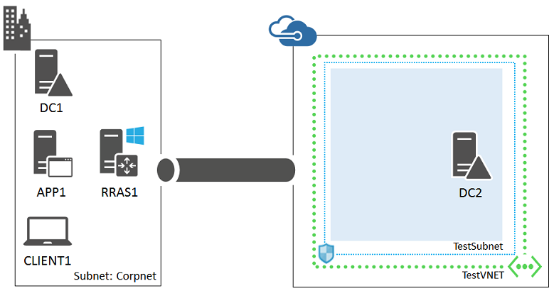

<properties 
	pageTitle="LOB 应用程序测试环境 | Azure" 
	description="了解如何在混合云环境中创建基于 web 的业务线应用程序，以便进行 IT 专业人员测试或开发测试。" 
	services="virtual-machines-windows" 
	documentationCenter="" 
	authors="JoeDavies-MSFT" 
	manager="timlt" 
	editor=""
	tags="azure-resource-manager"/>

<tags
	ms.service="virtual-machines-windows"
	ms.date="08/08/2016"
	wacn.date="09/12/2016"/>

# 在混合云中设置用于测试且基于 Web 的 LOB 应用程序

本主题逐步讲解如何创建模拟的混合云环境，以便测试在 Azure 中托管的基于 Web 的业务线 (LOB) 应用程序。这是生成的配置。

  

此配置包括：

- Azure (TestLab VNet) 中托管的模拟本地网络。
- 在 Azure 中托管的跨界虚拟网络 (TestVNET)。
- VNet 到 VNet 的 VPN 连接。
- TestVNET 虚拟网络中的基于 Web 的 LOB 服务器、SQL Server 和辅助域控制器。

此配置提供了基础和通用的起始点，你可以据此执行以下操作：

- 开发和测试在 Internet Information Services (IIS) 上托管且在 Azure 中存在 SQL Server 2014 数据库后端的 LOB 应用程序。
- 对这个基于混合云的模拟 IT 工作负荷执行测试。

设置此混合云测试环境需要完成以下三个主要阶段：

1.	设置模拟混合云环境。
2.	配置 SQL Server 计算机 (SQL1)。
3.	配置 LOB 服务器 (LOB1)。

此工作负荷需要 Azure 订阅。如果有 MSDN 或 Visual Studio 订阅，请参阅 [Monthly Azure credit for Visual Studio subscribers](https://azure.microsoft.com/pricing/member-offers/msdn-benefits-details/)（Visual Studio 订户的每月 Azure 信用额度）。

有关在 Azure 中托管的生产型 LOB 应用程序的示例，请参阅 [Microsoft 软件体系结构关系图和蓝图](http://msdn.microsoft.com/dn630664)上的**业务线应用程序**体系结构蓝图。

## 阶段 1：设置模拟混合云环境

创建[模拟的混合云测试环境](/documentation/articles/virtual-machines-windows-ps-hybrid-cloud-test-env-sim/)。由于此测试环境不需要 Corpnet 子网上存在 APP1 服务器，因此现在可将其关闭。

这是你当前的配置。

 
## 阶段 2：配置 SQL Server 计算机 (SQL1)

从 Azure 门户启动 DC2 计算机（如果需要）。

接下来，在本地计算机上 Azure PowerShell 命令提示符下使用这些命令创建适用于 SQL1 的虚拟机。在运行这些命令之前，请填写变量值并删除 < 和 > 字符。

	$rgName="<your resource group name>"
	$locName="<the Azure location of your resource group>"
	$saName="<your storage account name>"
	
	$vnet=Get-AzureRMVirtualNetwork -Name "TestVNET" -ResourceGroupName $rgName
	$subnet=Get-AzureRmVirtualNetworkSubnetConfig -VirtualNetwork $vnet -Name "TestSubnet"
	$pip=New-AzureRMPublicIpAddress -Name SQL1-NIC -ResourceGroupName $rgName -Location $locName -AllocationMethod Dynamic
	$nic=New-AzureRMNetworkInterface -Name SQL1-NIC -ResourceGroupName $rgName -Location $locName -Subnet $subnet -PublicIpAddress $pip
	$vm=New-AzureRMVMConfig -VMName SQL1 -VMSize Standard_A4
	$storageAcc=Get-AzureRMStorageAccount -ResourceGroupName $rgName -Name $saName
	$vhdURI=$storageAcc.PrimaryEndpoints.Blob.ToString() + "vhds/SQL1-SQLDataDisk.vhd"
	Add-AzureRMVMDataDisk -VM $vm -Name "Data" -DiskSizeInGB 100 -VhdUri $vhdURI  -CreateOption empty
	
	$cred=Get-Credential -Message "Type the name and password of the local administrator account for the SQL Server computer." 
	$vm=Set-AzureRMVMOperatingSystem -VM $vm -Windows -ComputerName SQL1 -Credential $cred -ProvisionVMAgent -EnableAutoUpdate
	$vm=Set-AzureRMVMSourceImage -VM $vm -PublisherName MicrosoftSQLServer -Offer SQL2014-WS2012R2 -Skus Standard -Version "latest"
	$vm=Add-AzureRMVMNetworkInterface -VM $vm -Id $nic.Id
	$storageAcc=Get-AzureRMStorageAccount -ResourceGroupName $rgName -Name $saName
	$osDiskUri=$storageAcc.PrimaryEndpoints.Blob.ToString() + "vhds/SQL1-OSDisk.vhd"
	$vm=Set-AzureRMVMOSDisk -VM $vm -Name "OSDisk" -VhdUri $osDiskUri -CreateOption fromImage
	New-AzureRMVM -ResourceGroupName $rgName -Location $locName -VM $vm

在 Azure 门户中使用 SQL1 的本地管理员帐户连接到 SQL1。

接下来，请配置 Windows 防火墙规则，允许基本的连接测试和 SQL Server 流量。在 SQL1 上管理员级 Windows PowerShell 命令提示符下运行这些命令。

	New-NetFirewallRule -DisplayName "SQL Server" -Direction Inbound -Protocol TCP -LocalPort 1433,1434,5022 -Action allow 
	Set-NetFirewallRule -DisplayName "File and Printer Sharing (Echo Request - ICMPv4-In)" -enabled True
	ping dc2.corp.contoso.com

使用 ping 命令时，会从 IP 地址 192.168.0.4 传回四个成功的答复。

接下来，在 SQL1 上添加额外的数据磁盘作为驱动器盘符为 F: 的新卷。

1.	在服务器管理器的左窗格中，单击**“文件和存储服务”**，然后单击**“磁盘”**。
2.	在内容窗格的“磁盘”组中，单击“磁盘 2”（其“分区”设置为“未知”）。
3.	单击**“任务”**，然后单击**“新建卷”**。
4.	在新建卷向导的“开始之前”页上，单击**“下一步”**。
5.	在“选择服务器和磁盘”页上，单击“磁盘 2”，然后单击“下一步”。出现提示时，单击“确定”。
6.	在“指定卷的大小”页上，单击**“下一步”**。
7.	在“分配到驱动器号或文件夹”页上，单击**“下一步”**。
8.	在“选择文件系统设置”页上，单击**“下一步”**。
9.	在“确认选择”页上，单击**“创建”**。
10.	完成后，单击**“关闭”**。

在 SQL1 上的 Windows PowerShell 命令提示符处运行以下命令：

	md f:\Data
	md f:\Log
	md f:\Backup

接下来，在 SQL1 上的 Windows PowerShell 提示符下使用以下命令将 SQL1 加入 CORP Windows Server Active Directory 域。

	Add-Computer -DomainName corp.contoso.com
	Restart-Computer

当系统提示为 **Add-Computer** 命令提供域帐户凭据时，请使用 CORP\\User1 帐户。

重新启动后，在 Azure 门户中*使用 SQL1 的本地管理员帐户*连接到 SQL1。

接下来对 SQL Server 2014 进行配置，以便将 F: 驱动器用于新的数据库和用户帐户权限。

1.	在“开始”屏幕中，键入“SQL Server 管理”，然后单击“SQL Server 2014 Management Studio”。
2.	在**“连接到服务器”**中，单击**“连接”**。
3.	在“对象资源管理器”树窗格中，右键单击“SQL1”，然后单击“属性”。
4.	在“服务器属性”窗口中，单击“数据库设置”。
5.	找到“数据库默认位置”，然后设置以下值：
	- 对于“数据”，请键入路径 **f:\\Data**。
	- 对于“日志”，请键入路径 **f:\\Log**。
	- 对于“备份”，请键入路径 **f:\\Backup**。
	- 注意：只有新数据库使用这些位置。
6.	单击“确定”以关闭该窗口。
7.	在“对象资源管理器”树窗格中，打开“安全性”。
8.	右键单击“登录名”，然后单击“新建登录名”。
9.	在“登录名”中，键入“CORP\\User1”。
10.	在“服务器角色”页上，单击“sysadmin”，然后单击“确定”。
11.	关闭 Microsoft SQL Server Management Studio。

这是你当前的配置。

  

 
## 阶段 3：配置 LOB 服务器 (LOB1)

首先，在本地计算机上的 Azure PowerShell 命令提示符下使用这些命令创建适用于 LOB1 的虚拟机。

	$rgName="<your resource group name>"
	$locName="<your Azure location, such as China North>"
	$saName="<your storage account name>"
	
	$vnet=Get-AzureRMVirtualNetwork -Name "TestVNET" -ResourceGroupName $rgName
	$subnet=Get-AzureRmVirtualNetworkSubnetConfig -VirtualNetwork $vnet -Name "TestSubnet"
	$pip=New-AzureRMPublicIpAddress -Name LOB1-NIC -ResourceGroupName $rgName -Location $locName -AllocationMethod Dynamic
	$nic=New-AzureRMNetworkInterface -Name LOB1-NIC -ResourceGroupName $rgName -Location $locName -Subnet $subnet -PublicIpAddress $pip
	$vm=New-AzureRMVMConfig -VMName LOB1 -VMSize Standard_A2
	$storageAcc=Get-AzureRMStorageAccount -ResourceGroupName $rgName -Name $saName
	$cred=Get-Credential -Message "Type the name and password of the local administrator account for LOB1."
	$vm=Set-AzureRMVMOperatingSystem -VM $vm -Windows -ComputerName LOB1 -Credential $cred -ProvisionVMAgent -EnableAutoUpdate
	$vm=Set-AzureRMVMSourceImage -VM $vm -PublisherName MicrosoftWindowsServer -Offer WindowsServer -Skus 2012-R2-Datacenter -Version "latest"
	$vm=Add-AzureRMVMNetworkInterface -VM $vm -Id $nic.Id
	$osDiskUri=$storageAcc.PrimaryEndpoints.Blob.ToString() + "vhds/LOB1-TestLab-OSDisk.vhd"
	$vm=Set-AzureRMVMOSDisk -VM $vm -Name LOB1-TestVNET-OSDisk -VhdUri $osDiskUri -CreateOption fromImage
	New-AzureRMVM -ResourceGroupName $rgName -Location $locName -VM $vm

接下来，在 Azure 门户中使用 SQL1 的本地管理员帐户的凭据连接到 LOB1。

接下来，配置 Windows 防火墙规则，以允许进行基本的连接测试所需的流量。从 LOB1 上的管理员级 Windows PowerShell 命令提示符下运行这些命令。

	Set-NetFirewallRule -DisplayName "File and Printer Sharing (Echo Request - ICMPv4-In)" -enabled True
	ping dc2.corp.contoso.com

使用 ping 命令时，会从 IP 地址 192.168.0.4 传回四个成功的答复。

接下来，在 Windows PowerShell 提示符下使用以下命令将 LOB1 加入 CORP Active Directory 域。

	Add-Computer -DomainName corp.contoso.com
	Restart-Computer

当系统提示为 **Add-Computer** 命令提供域帐户凭据时，请使用 CORP\\User1 帐户。

重新启动后，在 Azure 门户中使用 CORP\\User1 帐户和密码连接到 LOB1。

接下来，为 IIS 配置 LOB1 并测试从 CLIENT1 进行的访问。

1.	在服务器管理器中，单击“添加角色和功能”。
2.	在“开始之前”页上，单击“下一步”。
3.	在“选择安装类型”页上，单击“下一步”。
4.	在“选择目标服务器”页上，单击“下一步”。
5.	在“服务器角色”页上，单击“角色”列表中的“Web 服务器(IIS)”。
6.	出现提示时，单击**“添加功能”**，然后单击**“下一步”**。
7.	在“选择功能”页上，单击“下一步”。
8.	在“Web 服务器(IIS)”页上，单击“下一步”。
9.	在“选择角色服务”页上，选择或清除测试 LOB 应用程序所需的服务的复选框，然后单击“下一步”。
10.	在“确认安装选择”页上，单击“安装”。
11.	等待，直到组件安装完成，然后单击“关闭”。
12.	在 Azure 门户中，使用 CORP\\User1 帐户凭据连接到 CLIENT1 计算机，然后启动 Internet Explorer。
13.	在地址栏中，键入 **http://lob1/**，然后按 Enter。你会看到默认的 IIS 8 网页。

这是你当前的配置。

 
此环境现在已准备就绪，可用于在 LOB1 上部署基于 Web 的应用程序，以及在 Corpnet 子网上通过 CLIENT1 测试功能。

## 后续步骤

- 使用 [Azure 门户](/documentation/articles/virtual-machines-windows-hero-tutorial/)添加新虚拟机。

<!---HONumber=Mooncake_0905_2016-->