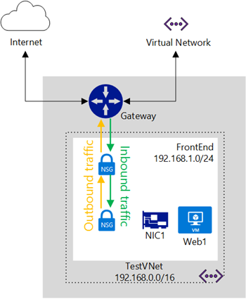

<properties 
   pageTitle="什么是网络安全组 (NSG)"
   description="了解网络安全组 (NSG)"
   services="virtual-network"
   documentationCenter="na"
   authors="telmosampaio"
   manager="carmonm"
   editor="tysonn" />
<tags
	ms.service="virtual-network"
	ms.date="02/11/2016"
	wacn.date="03/17/2016"/>

# 什么是网络安全组 (NSG)？

网络安全组 (NSG) 包含一系列访问控制列表 (ACL) 规则，这些规则可以允许或拒绝虚拟网络中流向 VM 实例的网络流量。NSG 可以与子网或该子网中的各个 VM 实例相关联。当 NSG 与某个子网相关联时，ACL 规则适用于该子网中的所有 VM 实例。另外，可以进一步通过将 NSG 直接关联到单个 VM 对流向该 VM 的流量进行限制。

## NSG 资源

NSG 包含以下属性。

|属性|说明|约束|注意事项|
|---|---|---|---|
|Name|NSG 的名称|必须在区域内唯一 可以包含字母、数字、下划线、句点和连字符 必须以字母或数字开头 必须以字母、数字或下划线结尾 最多可以有 80 个字符|由于你可能需要创建多个 NSG，因此请确保设置命名约定，以便轻松标识 NSG 的功能。|
|规则|规则用于定义允许或拒绝的具体流量||请参阅下面的 [NSG 规则](#Nsg-rules)| 

>[AZURE.NOTE] 不支持将基于终结点的 ACL 和网络安全组置于相同 VM 实例上。如果你想要使用 NSG，但已有了终结点 ACL，则请先删除该终结点 ACL。有关如何执行此操作的信息，请参阅[使用 PowerShell 管理终结点的访问控制列表 (ACL)](/documentation/articles/virtual-networks-acl-powershell/)。

### NSG 规则

NSG 规则包含以下属性。

|属性|说明|约束|注意事项|
|---|---|---|---|
|**Name**|规则的名称|必须在区域内唯一 可以包含字母、数字、下划线、句点和连字符 必须以字母或数字开头 必须以字母、数字或下划线结尾 最多可以有 80 个字符|一个 NSG 中可以有多个规则，因此请确保遵循命名约定，以便标识规则的功能|
|**协议**|要与规则匹配的协议|TCP、UDP 或 *|使用 * 作为协议时，其内容将包括 ICMP（仅限东-西方向的流量）、UDP 和 TCP，这可能会减少所需规则的数目 同时，使用 * 对于一种方法来说其范围可能太广泛了，因此请确保只在真正需要时使用|
|**Source port range**|要与规则匹配的源端口范围|单个端口号（从 1 到 65535）、端口范围（例如 100-2000）或 *（针对所有端口）|尽可能尝试使用端口范围，这样就不需要多个规则|
|**Destination port range**|要与规则匹配的目标端口范围|单个端口号（从 1 到 65535）、端口范围（例如 100-2000）或 *（针对所有端口）|尽可能尝试使用端口范围，这样就不需要多个规则|
|**Source address prefix**|要与规则匹配的源地址前缀或标记|单一 IP 地址（例如 10.10.10.10）、IP 子网（例如 192.168.1.0/24）、[默认标记](#Default-Tags)或 *（针对所有地址）|考虑使用范围、标记和 * 来减少规则数|
|**Destination address prefix**|要与规则匹配的目标地址前缀或标记|单一 IP 地址（例如 10.10.10.10）、IP 子网（例如 192.168.1.0/24）、[默认标记](#Default-Tags)或 *（针对所有地址）|考虑使用范围、标记和 * 来减少规则数|
|**Direction**|要与规则匹配的流量方向|入站或出站|入站和出站规则将根据方向分别处理|
|**Priority**|按优先顺序检查规则，只要应用了一个规则，就不会测试其他规则来进行匹配|介于 100 到 65535 之间的数字|可考虑创建规则跳转优先级（每个规则 100），以便在现有规则之间插入新规则|
|**Access**|规则匹配时要应用的访问类型|允许或拒绝|请记住，如果找不到某个数据包的允许规则，则丢弃该数据包|

NSG 包含两种类型的规则：入站规则和出站规则。在每组中，规则的优先级必须保持唯一。

上图显示如何处理 NSG 规则。

### 默认标记

默认标记是系统提供的针对某类 IP 地址的标识符。你可以使用任何规则的 **source address prefix** 和 **destination address prefix** 属性中的默认标记。有三个可使用的默认标记。

- **VIRTUAL\_NETWORK:** 此默认标记表示你的所有网络地址空间。它包括虚拟网络地址空间（Azure 中定义的 CIDR 范围）以及所有连接的本地地址空间和连接的 Azure VNet（本地网络）。

- **AZURE\_LOADBALANCER:** 此默认标记表示 Azure 的基础结构负载平衡器。这将转换到 Azure 数据中心 IP，从中进行 Azure 的运行状况探测。

- **INTERNET:** 此默认标记表示虚拟网络外部的 IP 地址空间，可以通过公共 Internet 进行访问。此范围还包括 [Azure 拥有的公共 IP 空间](https://www.microsoft.com/download/details.aspx?id=41653)。

### 默认规则

所有 NSG 都包含一组默认规则。默认规则无法删除，但由于给它们分配的优先级最低，可以用创建的规则来重写它们。

正如以下默认规则所阐述的那样，从方向上来说，在 VNet 中发起和结束的流量可以是入站流量，也可以是出站流量。虽然出站方向的流量允许连接到 Internet，但默认情况下，入站方向的流量在连接到 Internet 时会被阻止。有一个默认的规则，该规则允许 Azure 的负载平衡器探测 VM 和角色实例的运行状况。如果不使用负载平衡集，则可以覆盖此规则。

**入站默认规则**

| Name | Priority | Source IP | Source Port | Destination IP | Destination Port | 协议 | Access |
|-----------------------------------|----------|--------------------|-------------|-----------------|------------------|----------|--------|
| ALLOW VNET INBOUND | 65000 | VIRTUAL\_NETWORK | * | VIRTUAL\_NETWORK | * | * | ALLOW |
| ALLOW AZURE LOAD BALANCER INBOUND | 65001 | AZURE\_LOADBALANCER | * | * | * | * | ALLOW |
| DENY ALL INBOUND | 65500 | * | * | * | * | * | DENY |

**出站默认规则**

| Name | Priority | Source IP | Source Port | Destination IP | Destination Port | 协议 | Access |
|-------------------------|----------|-----------------|-------------|-----------------|------------------|----------|--------|
| ALLOW VNET OUTBOUND | 65000 | VIRTUAL\_NETWORK | * | VIRTUAL\_NETWORK | * | * | ALLOW |
| ALLOW INTERNET OUTBOUND | 65001 | * | * | INTERNET | * | * | ALLOW |
| DENY ALL OUTBOUND | 65500 | * | * | * | * | * | DENY |

## 将 NSG 相关联

可以将 NSG 关联到 VM 和子网，具体取决于你使用的部署模型。

[AZURE.INCLUDE [learn-about-deployment-models-both-include.md](../../includes/learn-about-deployment-models-both-include.md)]
 
- **将 NSG 关联到 VM（仅限经典部署）。** 将 NSG 关联到 VM 时，NSG 中的网络访问规则将应用到传入和传出 VM 的所有流量。 

- **将 NSG 关联到子网（所有部署）**。将 NSG 关联到子网时，NSG 中的网络访问规则将应用到子网中的所有 IaaS 和 PaaS 资源。

可以将不同的 NSG 关联到 VM 以及 VM 所绑定到的子网。如果发生这种情况，所有网络访问规则将按以下顺序应用到流量：

- **入站流量**
	1. 应用到子网的 NSG。
	2. 应用到 VM的 NSG（经典）。
- **出站流量**
	1. 应用到 VM的 NSG（经典）。
	2. 应用到子网的 NSG。

>[AZURE.NOTE] 尽管你只能将一个 NSG 关联到一个子网、VM，但你可以将同一 NSG 关联到任意数量的资源。

## 实现
你可以使用下列各种工具来实现经典 NSG。

|部署工具|经典|
|---|---|---|
|经典管理门户|![否][red]|
|PowerShell|<a href="/documentation/articles/virtual-networks-create-nsg-classic-ps/">![是][green]</a>|
|Azure CLI|<a href="/documentation/articles/virtual-networks-create-nsg-classic-cli/">![是][green]</a>|

|**键**|支持 ![是][green]。单击项目。|不支持 ![否][red]。|
|---|---|---|

## 规划

在实施 NSG 之前，你需要回答以下问题：

1. 你想要筛选哪些类型资源的进出流量，VM、多个 VM 还是他资源（例如连接到同一子网的云服务或应用程序服务环境，或者连接到不同子网的资源）？

2. 你要过滤其进出流量的资源是连接到现有 VNet 中的子网，还是连接到新的 VNet 或其子网？

## 设计注意事项

了解[规划](#Planning)部分问题的答案以后，请查看以下内容，然后再定义你的 NSG。

### 限制

在设计 NSG 时需要考虑以下限制。

|**说明**|**默认限制**|**含义**|
|---|---|---|
|可与子网、VM 关联的 NSG 数目|1|这意味着不能对 NSG 进行组合。确保给定资源集所需的所有规则已包括在单一 NSG 中。|
|每个区域每个订阅的 NSG 数目|100|默认情况下，你在 Azure 经典管理门户中创建的每个 VM 都会创建一个新的 NSG。如果你允许此默认行为，则会很快用光 NSG。请确保在设计时牢记此限制，根据需要将资源分成多个区域或订阅。 |
|每个 NSG 的 NSG 规则数|200|使用各种 IP 和端口，确保不超过此限制。 |

>[AZURE.IMPORTANT] 在设计解决方案之前，请确保查看所有[与 Azure 中的网络服务相关的限制](/documentation/articles/azure-subscription-service-limits/#networking-limits)。可以通过开具支持票证增加某些限制。

### VNet 和子网设计

由于 NSG 可以应用于子网，因此你可以通过按子网来组合资源以及将 NSG 应用到子网来尽量减少 NSG 的数量。如果你决定将 NSG 应用到子网，你可能会发现，现有的 VNet 和子网不是通过所要的 NSG 定义的。你可能需要定义新的 VNet 和子网来支持你的 NSG 设计。同时，你需要将新资源部署到新子网。然后，你才能定义一个迁移策略，将现有资源移到新子网。

### 特殊规则

你需要考虑下面所列的特殊规则。请确保不要阻止这些规则允许的流量，否则你的基础结构将无法与基本 Azure 服务通信。

- **主机节点的虚拟 IP：**基本基础结构服务（例如 DHCP、DNS 和运行状况监视）是通过虚拟化主机 IP 地址 168.63.129.16 提供的。此公用 IP 地址属于 Microsoft，并将是唯一的用于所有区域的虚拟化 IP 地址，而且没有其他用途。此 IP 地址映射到托管虚拟机的服务器计算机（主机节点）的物理 IP 地址。主机节点充当 DHCP 中继、DNS 递归解析器，以及进行负载平衡器运行状况探测和计算机运行状况探测的探测源。不应将针对此 IP 地址的通信视为一种攻击。

- **许可（密钥管理服务）：**在虚拟机中运行的 Windows 映像应该获得许可。因此，将会向处理此类查询的密钥管理服务主机服务器发送许可请求。这将始终在出站端口 1688 上进行。

### ICMP 通信

当前的 NSG 规则只允许使用 *TCP* 或 *UDP* 协议。没有 *ICMP* 的特定标记。但默认情况下，根据入站 VNet 规则，虚拟网络中允许 ICMP 流量，因为该规则支持 VNet 中任何端口和协议的传入和传出流量。

### 子网

- 考虑工作负荷所需的层数。可以通过使用子网来隔离每个层，并可将 NSG 应用到该子网。 
- 如果你需要针对 VPN 网关或 ExpressRoute 线路实现一个子网，请确保**不**将 NSG 应用到该子网。否则，跨 VNet 或跨界连接将不起作用。
- 如果你需要实现一个虚拟设备，请确保将该虚拟设备部署在自己的子网上，以便用户定义路由 (UDR) 能够正常工作。你可以实现一个子网级 NSG，以便筛选进出该子网的流量。详细了解[如何控制流量和使用虚拟设备](/documentation/articles/virtual-networks-udr-overview/)。

### 其他

- 不支持将基于终结点的 ACL 和 NSG 置于相同 VM 实例上。如果你想要使用 NSG，但已有了终结点 ACL，则请先删除该终结点 ACL。有关如何执行此操作的信息，请参阅[管理终结点 ACL](/documentation/articles/virtual-networks-acl-powershell/)。
- 与使用负载平衡器类似，在筛选来自其他 VNet 的流量时，你必须使用远程计算机的源地址范围，而不能使用连接 VNet 的网关。
- 许多 Azure 服务不能连接到 Azure 虚拟网络，因此，进出这些服务的流量不能通过 NSG 进行筛选。请阅读所用服务的文档，以确定这些服务能否连接到 VNet。

## 部署示例

为了说明如何应用本文中的信息，我们需要定义 NSG，以便筛选一个具有以下要求的两层工作负荷解决方案的网络流量：

1. 分隔前端（Windows Web 服务器）和后端（SQL 数据库服务器）的流量。
2. 负载平衡规则，将流向负载平衡器的流量转发到端口 80 上的所有 Web 服务器。
3. NAT 规则，将流入负载平衡器端口 50001 的流量转发到前端唯一一个 VM 上的端口 3389。
4. 不从 Internet 访问前端或后端 VM，要求 1 例外。
5. 不从前端或后端访问 Internet。
6. 访问前端端口 3389 的任何 Web 服务器，针对来自前端子网本身的流量。
7. 访问后端端口 3389 的所有 SQL Server VM，流量仅来自前端子网。
8. 访问后端端口 1433 的所有 SQL Server VM，流量仅来自前端子网。

如上图所示，*Web1* 和 *Web2* VM 连接到 *FrontEnd* 子网，*DB1* 和 *DB2* VM 连接到 *BackEnd* 子网。两个子网都属于 *TestVNet* VNet。所有资源都分配给*中国北部* Azure 区域。

上面的要求 1-6（3 除外）全都针对子网空间。为了最大程度地减少每个 NSG 的规则数，同时为了方便将更多 VM 添加到所运行的工作负荷类型与现有 VM 相同的子网，我们可以实施以下子网级 NSG。

### FrontEnd 子网的 NSG

**传入规则**

|规则|Access|Priority|Source address range|Source port|Destination address range|Destination port|协议|
|---|---|---|---|---|---|---|---|
|允许 HTTP|允许|100|INTERNET|*|*|80|TCP|
|允许来自 FrontEnd 的 RDP|允许|200|192\.168.1.0/24|*|*|3389|TCP|
|拒绝来自 Internet 的任何流量|拒绝|300|INTERNET|*|*|*|TCP|

**传出规则**

|规则|Access|Priority|Source address range|Source port|Destination address range|Destination port|协议|
|---|---|---|---|---|---|---|---|
|拒绝 Internet|拒绝|100|*|*|INTERNET|*|*|

### BackEnd 子网的 NSG

**传入规则**

|规则|Access|Priority|Source address range|Source port|Destination address range|Destination port|协议|
|---|---|---|---|---|---|---|---|
|拒绝 Internet|拒绝|100|INTERNET|*|*|*|*|

**传出规则**

|规则|Access|Priority|Source address range|Source port|Destination address range|Destination port|协议|
|---|---|---|---|---|---|---|---|
|拒绝 Internet|拒绝|100|*|*|INTERNET|*|*|

### FrontEnd 中单一 VM 的 NSG，适用于来自 Internet 的 RDP

**传入规则**

|规则|Access|Priority|Source address range|Source port|Destination address range|Destination port|协议|
|---|---|---|---|---|---|---|---|
|允许来自 Internet 的 RDP|允许|100|INTERNET|**|*|3389|TCP|

>[AZURE.NOTE] 请注意，此规则的源地址范围是 **Internet**，不是负载平衡器的 VIP；源端口是 **\***，不是 500001。请勿混淆 NAT 规则/负载平衡规则和 NSG 规则。NSG 规则始终与流量的最初源和最终目标相关，与二者之间的负载平衡器**无关**。

## 后续步骤

- [在经典部署模型中部署 NSG](/documentation/articles/virtual-networks-create-nsg-classic-ps/)。
- [管理 NSG 日志](/documentation/articles/virtual-network-nsg-manage-log/)。

[green]: ./media/virtual-network-nsg-overview/green.png
[yellow]: ./media/virtual-network-nsg-overview/yellow.png
[red]: ./media/virtual-network-nsg-overview/red.png

<!---HONumber=Mooncake_0307_2016-->